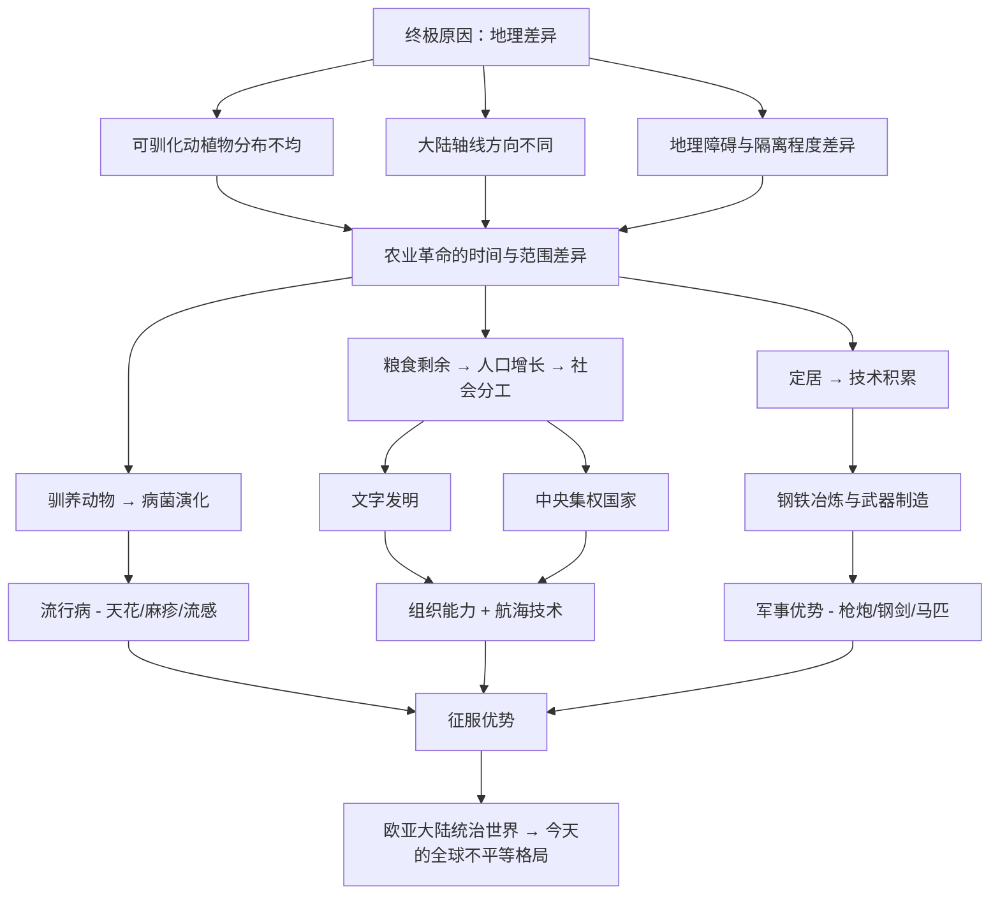

# 《枪炮、病菌与钢铁：人类社会的命运》—— 调研报告

> **英文原名**：*Guns, Germs, and Steel: The Fates of Human Societies*
> **作者**：贾雷德·戴蒙德（Jared Diamond）
> **首次出版**：1997年
> **所获奖项**：1998年普利策奖（非虚构类）、英国科普图书奖（Rhône-Poulenc Prize）、Phi Beta Kappa科学奖 [citation:Pulitzer Prize](https://www.pulitzer.org/winners/jared-diamond)

---

## 一、作者背景：贾雷德·戴蒙德（Jared Diamond）

### 个人履历

| 项目 | 内容 |
|------|------|
| **全名** | Jared Mason Diamond |
| **出生** | 1937年9月10日，美国马萨诸塞州波士顿 |
| **国籍** | 美国 |
| **身份** | 科学家、历史学家、地理学家、作家、演化生物学家 |
| **现任** | 加州大学洛杉矶分校（UCLA）地理学教授、生理学教授 |

---

## 二、全书结构与章节详解

### 总体结构

全书分为 **前言 + 四大部分，共19章 + 后记**（2017年20周年纪念版增加了一章关于日本的内容和新的后记）。

### 前言：亚力的疑问（Prologue: Yali's Question）

> **全书的起点——一个改变了历史研究方式的问题**

1972年，戴蒙德在巴布亚新几内亚进行鸟类田野研究时，当地一位名叫**亚力（Yali）**的著名政治家向他提出了一个简单但深刻的问题：

> *"为什么你们白人制造了那么多货物（cargo），并且把它们带到新几内亚，而我们黑人却几乎没有属于自己的货物？"*

用更学术的语言表述就是：**为什么在过去1.3万年的时间里，不同大陆上的人类社会发展出了如此巨大的技术和权力差异？为什么是欧亚大陆征服了其他大陆，而不是反过来？**

戴蒙德指出，传统的解释往往归结为"种族优越论"——认为某些人种在智力或能力上天生优于其他人种。他明确表示：
1. 这不是智力差异——他在新几内亚接触的人普遍比欧洲人更聪明、更有生存能力
2. 这也不是文化优越性
3. 答案是**地理和环境因素**的差异

**戴蒙德的回答框架：** 不同大陆上的人获得了不同的"初始条件"——可驯化的动植物种类、大陆的轴线方向、地理障碍等因素，导致农业发展的时间不同、速度不同，进而导致病菌免疫、技术进步和政治组织的差异。

---

### 第一部分：从伊甸园到卡哈马卡（Part One: From Eden to Cajamarca）

#### 第1章：上溯起跑线（Chapter 1: Up to the Starting Line）

**核心内容：** 人类如何在约700万年前从猿类分化出来，经历直立行走、使用工具、大脑发育等演化阶段，最终在大约5万年前完成了"大跃进"——出现了现代人类行为和语言能力。

**关键论点：**
- 到公元前11000年（末次冰期结束时），全球人类都处于狩猎采集阶段，各大陆之间的技术差距极小
- 如果当时有外星人观察地球，他们无法预测哪个大陆的人将占据支配地位
- 所有人类的"起跑线"基本相同，关键变量是之后的环境差异

#### 第2章：历史的自然实验（Chapter 2: A Natural Experiment of History）

**核心内容：** 戴蒙德提出波利尼西亚群岛作为"历史的自然实验"。波利尼西亚人源自同一祖先文化，但在不同岛屿上演化出了截然不同的社会形态——

| 岛屿 | 环境特点 | 社会结果 |
|------|---------|---------|
| 夏威夷 | 肥沃、大岛、多资源 | 复杂酋邦、等级森严、人口密集、农业发达 |
| 新西兰北部 | 温带、可农耕 | 中等规模社会、农业与狩猎并存 |
| 查塔姆群岛（莫里奥里人） | 寒冷、不宜农耕 | 小型和平狩猎采集社会、无战争 |

**关键论点：** 同一批人在不同环境中发展出不同社会，证明了**环境决定社会发展**——而非种族或文化差异。

#### 第3章：卡哈马卡的冲突（Chapter 3: Collision at Cajamarca）

**核心内容：** 分析1532年西班牙征服者**皮萨罗（Francisco Pizarro）**以**168名士兵**击败印加皇帝**阿塔瓦尔帕**的**8万大军**这一历史事件。

**皮萨罗获胜的四个直接原因（即"枪炮、病菌与钢铁"的首次亮相）：**
1. **枪炮（Guns）**：西班牙人的火绳枪和马匹在南美战场具有绝对的武器代差
2. **病菌（Germs）**：天花等欧亚流行病已在皮萨罗到达之前就传遍印加帝国，杀死大量印加人（包括皇帝瓦伊纳·卡帕克），引发内战
3. **钢铁（Steel）**：西班牙人的钢剑、钢甲、钢制武器远胜于印加人的石制、木制武器和棉甲
4. **文字与中央集权**：西班牙人有书写文字、航海图、政治体系，能调动跨洋资源

**关键论点：** 卡哈马卡战役是"枪炮、病菌与钢铁"如何赋予欧亚征服者压倒性优势的典型案例。

---

### 第二部分：食物生产的兴起与传播（Part Two: The Rise and Spread of Food Production）

#### 第4章：农民的力量（Chapter 4: Farmer Power）

**核心内容：** 为什么农业生产是社会发展最关键的革命。

**农业革命带来的连锁优势：**
- 可储存的剩余粮食 → 养活非农业人口（工匠、士兵、官僚、僧侣、国王）
- 定居生活 → 人口密度大幅增加
- 驯养动物 → 提供劳力、肥料、运输、以及**病菌**
- 粮食富余 → 社会分工、文字发明、技术创新、政治组织复杂化

**关键金句：**
> *"农业是人类社会所有重大分化的基础。"*

#### 第5章：历史上的富与穷（Chapter 5: History's Haves and Have-Nots）

**核心内容：** 全球植物和动物驯化的地理分布差异。

**关键数据：**

| 地区 | 可用于驯化的野生大籽粒禾本科植物数量 | 已驯化的大型哺乳动物数量 |
|------|:---:|:---:|
| 西南亚（新月沃地） | 约56种（其中许多被成功驯化） | 牛、山羊、绵羊、猪、马 |
| 中国 | 大量 | 水牛、猪、鸡、鸭、蚕 |
| 中美洲 | 较少（主要只有玉米） | 火鸡、狗 |
| 安第斯地区 | 有限 | 羊驼、豚鼠 |
| 澳大利亚 | 几乎没有 | **0种** |
| 非洲撒哈拉以南 | 有限（高粱、非洲稻等） | 斑马（从未被驯化）、非洲水牛 |

**关键论点：** 欧亚大陆拥有**更多的可驯化动植物物种**，这是地理上的偶然，而非任何一方的智慧或能力差异。

#### 第6章：种地还是不种地（Chapter 6: To Farm or Not to Farm）

**核心内容：** 农业为什么会在某些地区独立产生？狩猎采集者为什么会放弃"悠闲"的生活去从事更辛苦的农业？

**关键论点：**
- 农业不是"发明"出来的，而是**逐渐选择的**——在资源丰富的地区，狩猎采集者没有动机转向农业
- 在资源稀缺或环境变化的地区，人们被迫依赖越来越广泛的植物利用，最终走向驯化
- 农业的发生需要三个条件：**合适的可驯化植物 + 环境压力 + 足够长时间的试验**
- 全球只有**9个**农业独立起源中心（包括西南亚、中国、中美洲、安第斯地区等）

#### 第7章：如何制造一颗杏仁（Chapter 7: How to Make an Almond）

**核心内容：** 植物驯化的过程——如何将野生有毒的植物改造成可食用的作物。

**案例：杏仁的驯化**
- 野生杏仁含有剧毒（氰化物），一颗野生杏仁就能杀死一个人
- 但偶然的**基因突变**使少数杏仁变甜、无毒
- 早期农夫无意识中选择种植那些突变甜杏仁的树
- 这一过程持续数千年，最终全部的栽培杏仁都变成了甜杏仁

**关键论点：** 植物驯化是通过**选择性繁殖**（最初往往是无意识的）逐渐进行的。适合驯化的植物必须具有：高产量、快速生长、易于储存、自花授粉、无毒或毒素可控等特性。

**戴蒙德清单：** 世界上有约20万种野生植物，只有几千种可食用，只有几百种被不同程度驯化，而**真正改变世界的仅有十几种**（小麦、大麦、水稻、玉米、马铃薯、大豆、高粱等）。

#### 第8章：苹果还是印第安人（Chapter 8: Apples or Indians）

**核心内容：** 农业在不同大陆传播速度和范围的差异。

**关键论点：**
- "苹果"指北美——北美土著没有驯化本土苹果（虽然苹果树存在），因为当地缺乏其他可驯化的大型动物和植物组合，无法形成农业综合体系
- "印第安人"指美国东南部有发达的木兰文化（Mound Builders），他们有玉米农业，但这是从中美洲引入的，而非本地独立发展
- **关键因素**：即使有可驯化的植物，如果没有合适的动物、储藏技术、气候条件等配套因素，农业也无法独立发展

**戴蒙德的核心论点提出：** 不同大陆上可驯化动植物物种库的差异，加上大陆轴线方向（东西向 vs 南北向）决定了农业传播的速度与范围——这是整个理论体系的基础。

#### 第9章：斑马、不幸的婚姻与安娜·卡列尼娜原则（Chapter 9: Zebras, Unhappy Marriages, and the Anna Karenina Principle）

> *"幸福的家庭都是相似的，不幸的家庭各有各的不幸。"*

**核心内容：** 为什么全世界148种大型野生陆生食草/杂食哺乳动物中，只有**14种**被成功驯化？

**托尔斯泰的安娜·卡列尼娜原则在动物驯化上的应用：**
一个动物要被成功驯化，必须同时满足**全部**条件：
1. **饮食**：容易获得食物（不能挑食）
2. **生长速度**：长得快（让驯化经济可行）
3. **繁殖行为**：在圈养中愿意交配
4. **性情**：温顺、不危险
5. **不恐慌**：受惊时不乱跑乱撞致死
6. **社会结构**：有群体等级意识，能接受人类作为"首领"

**经典案例分析——斑马为什么没有被驯化？**
- 斑马咬人后不松口（有记录表明曾咬断饲养员手指）
- 斑马成年后极度凶猛，无法控制
- 尽管19世纪欧洲人曾试图驯化斑马来替代马匹（因为斑马抗昏睡病），但全部失败
- **不是非洲人"没有尝试"，而是斑马本身就不可驯化**

**关键论点：** 欧亚大陆之所以幸运，不是因为欧亚人更聪明，而是因为**欧亚大陆碰巧拥有最多的可驯化动物物种**——14种可驯化大型哺乳动物中，13种原产于欧亚大陆（只有羊驼来自南美）。

#### 第10章：广阔的天空与倾斜的轴线（Chapter 10: Spacious Skies and Tilted Axes）

> **本书最核心的论点之一**

**关键论点：** 大陆的轴线方向（东西向 vs 南北向）对农业和文明的传播有巨大影响。

| 大陆 | 轴线方向 | 对农业传播的影响 |
|------|---------|----------------|
| **欧亚大陆** | **东西向**（纬度跨度小，同纬度气候相似） | ⭐ **快速传播**：作物和家畜在同纬度带内迅速传播，从地中海到中国，从印度到欧洲 |
| **美洲** | 南北向 | ❌ **传播缓慢**：玉米从中美洲到北美需适应不同气候带；马铃薯在南美安第斯山区适应高海拔，难以在低地热带生长 |
| **非洲** | 南北向 | ❌ 撒哈拉以南非洲的热带作物与地中海作物无法直接交流 |
| **澳大利亚** | 单一 | 无 |

**具体例子：**
- 小麦从西南亚（新月沃地）出发，沿东西向迅速传播到欧洲、北非、印度河流域，速度可达每年约1公里
- 玉米从墨西哥出发，往北传播到北美需要数千年，往南传播到南美也需要数千年——因为每跨越一个纬度就需要适应新的气候、日照长度、降水量

**关键金句：**
> *"历史的轨迹不是由种族或文化决定的，而是由地理的偶然性塑造的。"*

---

### 第三部分：从食物到枪炮、病菌与钢铁（Part Three: From Food to Guns, Germs, and Steel）

#### 第11章：牲畜的致命礼物（Chapter 11: Lethal Gift of Livestock）

> **全书中关于"病菌"最震撼的一章**

**核心内容：** 为什么欧亚大陆的流行病（天花、麻疹、流感、鼠疫）在殖民过程中杀死了90-95%的美洲、澳洲和太平洋岛屿原住民？

**逻辑链条：**
1. 欧亚大陆驯化了大量群居大型哺乳动物（牛、猪、羊、马、鸡、鸭）
2. 人与动物长期密切接触 → 动物的病原体"跳跃"到人类身上
3. 密集的人口 → 疾病在人与人之间传播、维持并变异
4. 数千年演化 → 欧亚人获得了一定免疫力
5. 当欧洲人到达美洲时，他们的**无意释放的病菌比他们的枪炮杀伤力更大**

**震撼数据：**
- 美洲原住民人口在1500年估计有约2000万-1亿人
- 欧洲殖民后100年内，**约95%死亡**——最主要原因是传染病（天花、麻疹、流感），而非战争
- 天花随哥伦布第一次航行后传到加勒比，然后席卷整个美洲大陆
- 科尔特斯征服阿兹特克时，**天花造成的死亡比西班牙军队多得多**——阿兹特克人在天花面前成批死亡，而西班牙人几乎不受影响

**关键论点：**
> *"枪炮和钢铁是欧洲人征服的直接工具，但病菌才是致命的武器。在历史上，病菌杀死的原住民比枪炮杀死的多得多——而疾病的方向几乎总是从旧大陆指向新大陆，而非反之。"*

#### 第12章：蓝图与借来的字母（Chapter 12: Blueprints and Borrowed Letters）

**核心内容：** 文字的起源与传播——另一种"优势从农业而来"的表现。

| 文字起源类型 | 案例 | 地区 |
|------------|------|------|
| **独立发明** | 苏美尔楔形文字（约公元前3400年）、中美洲玛雅文字（约公元前600年）、中国文字、埃及象形文字 | 有农业文明的地区 |
| **借用改编** | 希腊字母（源自腓尼基字母）、拉丁字母（源自希腊字母）、日语假名（源自汉字） | 农业传播带 |

**关键论点：**
- 文字只有**在定居农业社会才被发明**——原因是农业社会有富余资源养活专业书吏，同时有记账、赋税、统治的实际需求
- 狩猎采集社会不需要文字（他们没有大量需要记录的信息）
- 文字总是在农业发达的地区首先出现——这并非文化优越性，而是**社会复杂化的必然产物**

#### 第13章：需要之母（Chapter 13: Necessity's Mother）

**核心内容：** 技术创新是如何发生的？为什么某些社会（而非其他社会）成为技术领先者？

**关键论点：**
- 传统观点认为"需要是发明之母"——先有需求，后有发明
- 戴蒙德提出相反观点：**许多发明最初并没有明确的需求**，发明出来后人们才找到用途
- 例子：爱迪生发明留声机时不知道它最主要用途将是音乐播放；瓦特的蒸汽机最初是为煤矿抽水设计的

**为什么技术在某些社会加速创新：**
1. **人口多、人口密度高** → 更多的潜在发明者和使用者
2. **地理互联** → 技术可以跨文化传播（而非每个社会都需要独立发明）
3. **农业剩余** → 养活非农业的工匠、发明家
4. **竞争压力** → 战争推动武器和军事技术发展

**关键论点：**
> *"技术创新不是某个天才的灵光一现，而是一个渐进的、累积的过程，在很大程度上依赖于已有知识的积累和传播。一个社会能否成为技术领先者，更多取决于其能否吸收和维持技术传播的渠道——而不是其人民的创造力。"*

#### 第14章：从平等到盗贼统治（Chapter 14: From Egalitarianism to Kleptocracy）

**核心内容：** 人类是如何从小型平等狩猎采集群体演变为大型复杂等级社会的？

| 社会类型 | 规模 | 食物获取 | 政治组织 | 社会平等性 |
|---------|------|---------|---------|-----------|
| 游群（Band） | 数十人 | 狩猎采集 | 无领袖 | 高度平等 |
| 部落（Tribe） | 数百人 | 园艺/初级农业 | 大人物（Big Men） | 相对平等 |
| 酋邦（Chiefdom） | 数千人 | 集约农业 | 世袭首领 | 等级化 |
| 国家（State） | 万人+ | 复杂农业+贸易 | 国王/官僚体系 | 高度不平等 |

**"盗贼统治"（Kleptocracy）的理论：**
- 所有复杂社会都面临一个根本矛盾：富有的精英如何让穷人大众接受资源和权力的不平等分配？
- 四种常见策略：
  1. **解除民众武装** + 武装精英（垄断武力）
  2. **再分配**（将剩余财富部分回馈给大众以换取支持）
  3. **意识形态控制**（宗教、神话将不平等合法化）
  4. **创造共同敌人**（外部威胁强化内部团结）

**关键论点：** 人口规模越大、社会越复杂，不平等就越不可避免——这不是道德选择而是**组织大型社会的必要条件**。

---

### 第四部分：环游世界五章（Part Four: Around the World in Five Chapters）

#### 第15章：亚力的人民（Chapter 15: Yali's People）

**核心内容：** 澳大利亚和新几内亚为什么成为人类发展最晚的大陆？

**关键论点：**
- 澳大利亚-新几内亚是最大的"另类"——当地土著没有发展出农业、文字、金属工具
- 原因：**地理隔离 + 物种匮乏**
  - 澳大利亚没有可驯化的本地植物和动物
  - 与世界其他地区的完全隔离（直到18世纪欧洲人到来）
  - 环境最干旱、最不稳定的有人居住大陆
- 新几内亚高地有独立产生的农业（约公元前7000年），但缺乏可驯化动物和蛋白质来源，发展受限

#### 第16章：中国如何成为中国（Chapter 16: How China Became Chinese）

**核心内容：** 中国文明的独特性——早期多中心、然后统一的巨大反差。

**关键论点：**
- 中国在公元前7500-2000年间存在多个独立的文化中心（黄河流域、长江流域、华南等），各自独立发展农业
- 但由于中国的地理特征：
  - 东西向的大河（黄河、长江）——便于东西交流
  - 南北向的运河（大运河）——统一南北
  - 相对平坦的地形——缺乏分割屏障
  - 相比之下，欧洲有阿尔卑斯山、地中海岛链等割裂因素
- 结果：**中国较早实现了政治统一**（秦朝公元前221年）
- 统一的好处与代价：
  - ✅ 大规模水利工程、统一文字、科技交流加速
  - ❌ 中央集权可做出一项错误决定就"关停"整个技术创新——如明朝的航海禁令、焚书坑儒

**对比欧洲：** 欧洲的分裂反而催生了**竞争性的城邦国家体系**——哥伦布被葡萄牙拒绝后可以去找西班牙；发明家从一个国家被驱逐后可逃往另一个国家。这种"竞争性创新环境"可能解释了欧洲为什么在公元1500年后超过中国。

#### 第17章：驶向波利尼西亚的快艇（Chapter 17: Speedboat to Polynesia）

**核心内容：** 东南亚岛民如何跨越广阔的太平洋，在缺乏农业可驯化资源的情况下殖民波利尼西亚群岛。

**关键论点：**
- 南岛语系（Austronesian）人群的扩张是人类历史上最壮观的迁移之一
- 从台湾出发（约公元前3000年），跨越整个太平洋到达夏威夷、复活节岛、新西兰
- 他们随身携带了"生命支持系统"：芋头、面包果、香蕉、椰子、狗、鸡、猪
- 这些动植物最初大部分来源于新几内亚和东南亚大陆，而不是台湾本地

#### 第18章：两个半球的大碰撞（Chapter 18: Hemispheres Colliding）

**核心内容：** 1492年哥伦布"发现"新大陆之后，东西半球之间的大交换（"哥伦布大交换"）。

**交换双向流程图：**

| 从旧大陆→新大陆 | 从新大陆→旧大陆 |
|----------------|----------------|
| 小麦、水稻、咖啡、甘蔗、香蕉、橄榄 | 玉米、马铃薯、红薯、木薯、番茄、辣椒、南瓜 |
| 牛、马、羊、猪、鸡 | 火鸡、羊驼 |
| 天花、麻疹、流感、鼠疫 | 梅毒（可能） |

**关键论点：** 
- 哥伦布大交换极大地改变了全球生态和人口分布
- 美洲的玉米和马铃薯成为旧大陆的重要主食——**马铃薯使欧洲人口在18-19世纪翻倍**
- 旧大陆的病菌对美洲原住民是毁灭性的，而美洲几乎没有可以反向传回旧大陆的致命疾病
- 这场交换不是对称的——**旧大陆对美洲的恩赐远大于美洲对旧大陆的，尤其是在病菌和动物方面**

#### 第19章：非洲是如何变黑的（Chapter 19: How Africa Became Black）

**核心内容：** 撒哈拉以南非洲的语言、人种和农业分布是如何形成的。

**关键类型：**

| 人群 | 语言系属 | 农业来源 | 扩展时间 |
|------|---------|---------|---------|
| 俾格米人 | 已消失（被同化） | 狩猎采集 | 非洲最古老居民 |
| 科伊桑人（布须曼人/霍屯督人） | 科伊桑语系（含搭嘴音） | 狩猎采集/牧羊 | 古老居民 |
| **班图人** | 尼日尔-刚果语系 | **独立发展农业** | **约公元前3000年开始从西非扩张** |
| 埃塞俄比亚人 | 亚非语系 | 独立发展农业（咖啡、高粱、苔麸） | 古老 |
| 马达加斯加人 | 南岛语系 | 来自东南亚 | 公元500年 |

**关键论点：**
- 撒哈拉以南非洲的农业有两处独立起源：西非（班图人起源地）和埃塞俄比亚高地
- 班图人的扩张是非洲历史上最重要的人口迁移——他们携带铁器、农业技术从西非向东南扩张，覆盖了大半个非洲
- 非洲农业发展的限制因素：**南北向轴线**（作物需要适应不同气候带）、缺乏可驯化的本地大型哺乳动物（斑马、非洲水牛、犀牛、大象均无法驯化）
- **睡虫病（trypanosomiasis）**是非洲牲畜农业发展的最大障碍——采采蝇传播的锥虫对欧亚驯化动物（牛、马、羊）高度致命，而非洲本地动物（如非洲水牛）已演化出抵抗力但无法被驯化

---

### 后记：历史作为一门科学（Epilogue: The Future of Human History as a Science）

**核心内容：** 戴蒙德总结全书的论证，并回应批评。

**全书的因果链总结（核心模型）：**

```
地理差异（可驯化动植物分布、大陆轴线方向）
      ↓
农业最早在欧亚大陆兴起并迅速传播
      ↓
人口增加、定居、社会复杂化
      ↓
技术（枪炮/钢铁）进步 + 文字出现 + 政治组织复杂化
      ↓
病菌演化（与驯养动物密切接触）
      ↓
欧亚大陆获得对世界其他地区的优势
      ↓
殖民扩张 → 全球不平等格局 → 今天的世界
```

戴蒙德强调：这不是说"自然环境决定一切"（环境决定论），而是**地理环境设定了初始条件，历史沿着这些条件展开**。个人的选择、偶然事件、文化因素也在起作用，但它们是在地理框架内运作的。

---

## 三、核心观点精华

### 本书最重要的五大核心论点

#### 1. 亚力之问（Yali's Question）—— 以"为什么"代替"谁优越"

> 全书最核心的问题意识：不是问"谁更优越"，而是问"为什么会有差异"。戴蒙德从根本上拒绝了种族主义解释框架，用地理和环境因素来解释全球发展不均衡。

#### 2. 农业革命是一切差距的根源

> 农业的出现在时间和空间上的差异，是随后所有社会差异的基础。没有农业革命就没有粮食剩余 → 就没有分工、文字、技术、国家、军队、病菌。而农业最早在"新月沃地"出现，纯粹是地理的偶然。

#### 3. 安娜·卡列尼娜原则：可驯化动物的稀缺性

> 全世界只有14种大型哺乳动物能被成功驯化，而它们几乎全部原产于欧亚大陆。这不是欧亚人更善于驯化动物，而是欧亚大陆的动物"恰好"符合所有驯化条件。非洲的斑马、犀牛、大象之所以没有被驯化，不是因为当地人笨，而是因为这些动物天生不可驯化。

#### 4. 大陆轴线方向决定文明传播速度

> 欧亚大陆东西向的轴线使作物、家畜、技术可以在同纬度带内快速传播（地中海→中国）。美洲和非洲南北向的轴线使农业传播必须跨越不同气候带，速度极慢。这不是智力的差异，而是地球地理的偶然。

#### 5. 病菌是无声的征服者

> 欧亚人征服美洲最重要的武器不是枪炮，而是天花、麻疹和流感。这些疾病源于欧亚人与驯养动物的数千年亲密接触，在旧大陆消灭了95%的原住民。病菌的传播方向几乎总是从旧大陆到新大陆，这是由动物驯化的历史决定的。

### 精华语录

> *"历史就像洋葱——一层层剥开，每一层都揭示出新的因果联系，直到你到达最底层：地理。"*

> *"历史的轨迹不是由种族或文化决定的，而是由地理的偶然性塑造的。"*

> *"农业不是发明出来的，而是被选择的——就像自然选择本身一样，是一个盲目的、渐进的过程。"*

> *"枪炮和钢铁是欧洲人征服的直接工具，但病菌才是致命的武器。"*

> *"在卡哈马卡，皮萨罗不是以168人战胜了8万印加人——他是以168人作为欧亚大陆数千年农业、动物驯化、病菌演化、技术积累和文字传统的代表，来对阵一个缺乏所有这些的地理孤岛。"*

> *"新几内亚人和欧洲人之间的差异，不在于智力，而在于各自祖先碰巧继承的地理起点。"*

> *"我们必须拒绝将全球发展差异归因于种族差异的解释，因为证据清楚地表明：原因在于环境，而非人。"*

---

## 四、重要争议与批评

戴蒙德的"地理决定论"框架在学术界引起了广泛讨论与批评，以下是最主要的几点：

### 1. 环境决定论过度简化
- **来自人类学家**：批评戴蒙德过度强调地理和环境因素，低估了人类能动性（human agency）——即人类通过文化、政治决策改变历史轨迹的能力
- **典型案例**：中国在15世纪主动选择了终止远洋航海（郑和下西洋的终止），这不是地理决定的，而是政治决策

### 2. 忽视殖民主义的持续影响
- 批评者指出：现代发展不均衡不仅是地理的遗产，更是殖民主义、奴隶贸易、帝国主义持续掠夺的结果
- 戴蒙德的框架可能被用来为殖民后果开脱（"地理决定的不平等，不是殖民者的错"）

### 3. 对非洲和美洲原住民的描述有简化之嫌
- 有学者认为戴蒙德低估了非洲和美洲前殖民时期文明的成就和复杂程度
- 批评者指出："缺少可驯化动物"并不等于"缺少复杂文明"

### 4. James Blaut等学者的批评
- 哥伦比亚大学地理学教授Blaut发表了长篇反驳，认为戴蒙德的证据选择有偏向性
- 质疑"欧亚大陆唯一优势"的论点忽略了许多反例

---

## 五、全书逻辑总结图



---

## 六、参考资料与延伸链接

### 图书信息
- **英文原版**：*Guns, Germs, and Steel: The Fates of Human Societies*, W.W. Norton, 1997, ISBN 978-0-393-31755-8
- **20周年纪念版**：2017年出版，新增关于日本的一章和新的后记
- **中文译本**：《枪炮、病菌与钢铁：人类社会的命运》，谢延光译，上海世纪出版集团

### 作者相关
- [Jared Diamond - Wikipedia](https://en.wikipedia.org/wiki/Jared_Diamond)
- [Jared Diamond - Pulitzer Prize获奖信息](https://www.pulitzer.org/winners/jared-diamond)
- [UCLA地理系 - Jared Diamond主页](https://geog.ucla.edu/people/jared-diamond)

### 书籍相关
- [Guns, Germs, and Steel - Wikipedia](https://en.wikipedia.org/wiki/Guns,_Germs,_and_Steel)
- [Guns, Germs, and Steel - GradeSaver学习指南](https://www.gradesaver.com/guns-germs-and-steel)
- [Guns, Germs, and Steel - eNotes章节总结](https://www.enotes.com/topics/guns-germs-steel)
- [Guns, Germs, and Steel - LitCharts摘要](https://www.litcharts.com/lit/guns-germs-and-steel/summary)
- [James Clear: Guns, Germs, and Steel 书摘](https://jamesclear.com/book-summaries/guns-germs-and-steel)

### 戴蒙德其他著作
- *The Third Chimpanzee*（第三种黑猩猩，1992）
- *Collapse: How Societies Choose to Fail or Succeed*（崩溃：社会如何选择成败兴衰，2005）
- *The World Until Yesterday*（昨日之前的世界，2012）
- *Upheaval: Turning Points for Nations in Crisis*（剧变：国家危机中的转折点，2019）

### 争议与学术讨论
- [James Blaut对《枪炮、病菌与钢铁》的批评](http://www.columbia.edu/~lnp3/mydocs/Blaut/diamond.htm) — 哥伦比亚大学
- [Living Anthropologically: Guns, Germs and Steel Distorts History](https://www.livinganthropologically