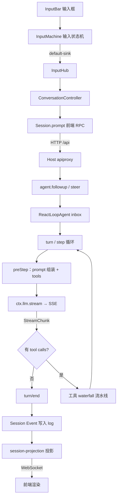

# DeepSeek Harness 与 Cordis 技术解读

### ——从"一句话的旅程"到"一切皆插件"的地基

> **本文由两篇源码分析文章汇总重构而成**
>
> - 上篇《DeepSeek Harness 源码分析》：追踪一句话从输入框到模型响应的完整链路
> - 下篇《DeepSeek Harness 背后的"心脏"：Cordis 到底是什么》：拆解支撑这套链路的插件化框架
>
> 两篇合起来才能看懂全貌：**上篇是现象，下篇是地基**。本文把两者对齐，并显式标出"工程特性 ↔ 底层机制"的对应关系。

---

## 目录

- [0. 导读：一个判断，两条线索](#0-导读一个判断两条线索)
- [1. 破题：它不是聊天工具](#1-破题它不是聊天工具)
- [2. 地基：Cordis 是什么](#2-地基cordis-是什么)
- [3. 装配：从 dsh web 到插件树](#3-装配从-dsh-web-到插件树)
- [4. 主链路：一句话的旅程](#4-主链路一句话的旅程)
- [5. 设计思想：五条原则及其底层机制](#5-设计思想五条原则及其底层机制)
- [6. 一切皆插件：槽位、生态与三种角色](#6-一切皆插件槽位生态与三种角色)
- [7. 自指：当 Agent 开始改装自己的运行时](#7-自指当-agent-开始改装自己的运行时)
- [8. 源码清单速查](#8-源码清单速查)
- [9. 总结：从开发者纪律到定理](#9-总结从开发者纪律到定理)
- [参考文献与链接](#参考文献与链接)

---

## 0. 导读：一个判断，两条线索

先给结论，再展开证据。

### 一个判断

DeepSeek Harness 开源后，很多人第一反应是"一个带聊天界面的模型调用工具"。但从源码看，官方对它的定位要底层得多：

> **Harness 的核心不是某个聊天组件，而是由 `Cordis Context + Service + Event + Plugin Fiber` 组成的 Agent Harness。**

它要解决的问题不是"怎么把模型接进聊天窗口"，而是：

> **如何搭建一个可组合、可扩展的 Agent 运行底座。**

判断标准很简单——在这套代码里，**模型是插件，工具是插件，UI 是插件，权限是插件，持久化是插件，连 Agent Loop 本身也是插件**。

### 两条线索

| | 上篇（现象层） | 下篇（地基层） |
| --- | --- | --- |
| **问的问题** | 一句话是怎么跑完的？ | 凭什么能这样跑？ |
| **主角** | `ReactLoopAgent`、工具流水线、Session Event | `Context`、`fiber`、`effect`、`Service` |
| **关键词** | turn/step、waterfall、Event Sourcing | 元框架、可逆副作用、响应式依赖 |
| **关系** | 上层建筑 | 承重结构 |

本文的组织方式：**先立地基（第 2 章），再看装配（第 3 章），然后走完整链路（第 4 章），最后把链路里每个设计决策映射回地基（第 5 章）。**

---

## 1. 破题：它不是聊天工具

### 1.1 项目结构

仓库是一个 pnpm monorepo，`package.json` 中声明的 workspace 使用 `packages/*/*` 这样的两级 glob——**真正的功能包大多在 `packages/<能力域>/<具体包>` 下面，而不是平铺在 packages 第一层**。当前源码里约有 **226 个 package**。

| 目录 | 职责 |
| --- | --- |
| `apps/cli` | 命令行入口。`apps/cli/src/bin.ts` 解析 `dsh web`、`profile`、`plugin`、`dump-config` 等命令，并调用 boot 层加载 profile |
| `apps/web` | Web 前端壳。`apps/web/src/main.ts` 很薄，只负责把 `@deepseek-ai/dsh-client-web` 挂载到 `#root` |
| `packages` | Harness 主体功能区，按能力域拆分：`core`、`llm`、`client`、`host`、`fs`、`shell`、`sandbox`、`subagent` 等 |
| `vendor` | 内置改造过的 Cordis 相关包：`cordis`、`loader`、`include`、`group`、`hmr`、`timer`、`schemastery`。**插件化底座在这里** |
| `native` | Native 辅助能力，目前重点是 `landlock-run`，服务 Linux sandbox 场景 |
| `python` | Python SDK / runtime，方便外部用 Python 侧驱动或集成 Harness |
| `docs` | 架构、Cordis primer、cookbook、子系统文档、工具流水线、扩展指南。**源码分析时非常关键** |
| `examples` | 独立示例：ACP、headless、JSON-RPC、MCP memory、web schedule 等 |
| `website` | 文档站点 |
| `scripts` | 构建、发布、类型生成、快照等脚本 |
| `patches` | 依赖 patch |

一句话概括顶层分工：

> **apps 是入口，packages 是产品能力，vendor 是框架底座，docs / examples 是说明与示范。**

### 1.2 packages 能力域地图

| 能力域 | 代表子包 | 职责 |
| --- | --- | --- |
| **boot** | `app-boot`、`cmdline` | profile 初始化、分层配置读取、Cordis Loader 启动 |
| **bundle** | `base`、`web-app`、`headless` | 预置插件组合，`cordis.patch.yml` 决定启动挂载哪些能力 |
| **core** | `agent`、`agent-loop`、`session`、`tools`、`system-prompt`、`scope` | Agent 核心：主循环、工具调用与执行、系统提示词模板 |
| **llm** | `llm`、`llm-deepseek`、`llm-pi-ai`、`llm-retry`、`token-meter` | 模型抽象与适配层 |
| **client** | `runtime`、`connection`、`web`、`ui-*` | 运行容器与前端 UI 组件 |
| **host** | `webserver`、`apiproxy`、`frontend-static`、`plugin-inventory`、`directory-picker` | Node Host 服务端：HTTP/WebSocket、RPC API、静态资源 |
| **api** | `gateway`、`remotes` | 前后端 RPC 及跨实例调用网关 |
| **session** | `session-persistence-*`、`session-projection-*`、`session-retrieval-*` | 会话持久化、投影更新、检索、导出 |
| **settings / credentials / storage** | `settings-file`、`credentials-local`、`storage-sqlite` | 配置、凭证、存储 |
| **fs** | `fs`、`fs-local`、`fs-sandbox`、`fs-ssh`、`tool-fs-*` | 文件系统能力分层 |
| **interaction** | `commands`、`user-approval`、`user-questions` | 提问、权限询问、Slash command |
| **shell / sandbox** | `tool-bash`、`bash-sandbox`、`subprocess-killer`、`sandbox-policy` | Shell 执行与沙箱隔离 |
| **guard** | `network-policy`、`network-deny-*` | 网络安全策略 |
| **compaction** | `compaction-basic`、`command-compact`、`compaction-tool-result-pruner` | 上下文压缩与裁剪 |
| **context** | `agent-instructions`、`file-reference`、`time-context`、`tmux-context` | 动态上下文注入 |
| **skill** | `skill`、`skill-filesystem`、`tool-skill` | Skill 注册表与 provider |
| **subagent** | `subagent`、`subagent-spawn-in-process` | 子 Agent 能力与并发 provider |
| **mcp** | `mcp-client` | MCP Server 接入 |
| **workflow** | `workflow`、`workflow-worker-thread`、`toolkit-io` | Workflow 引擎 |
| **goal / plan / jobs / schedule / todo** | `tool-goal`、`plan-mode`、`todo-*`、`schedule` | 目标分解、计划模式、后台任务、调度 |
| **sdk / acp** | `sdk-client`、`sdk-server`、`sdk-protocol`、`acp` | 扩展体系 |
| **test-support** | `agent-loop-tests`、`llm-replay`、`client-runtime` | 测试工具链与 mock / replay |

理解方式：

> **boot / bundle 负责启动装配；core + llm + client + host + api + session 构成主干；其余分层提供基础设施、执行环境与扩展生态能力。**

### 1.3 一个值得注意的拆法

文件能力不是一个 `FileTool` 包搞定，而是拆成四层：

```text
fs 服务定义（Service Definition）
fs-local 本地实现（Service Provider）
fs-sandbox 沙箱封装（Service Provider）
tool-fs 面向模型的工具（Consumer）
tool-fs-search 搜索工具（Consumer）
tool-fs-replace-editor 编辑工具（Consumer）
```

这就是后文要反复出现的 **Definition / Provider / Consumer 三层分离思路**。

---

## 2. 地基：Cordis 是什么

### 2.1 插件系统为什么要一个框架

假设你写了一个聊天机器人，最初逻辑都在一个文件里。功能变多后你开始拆模块——但**模块化只解决"代码怎么组织"**，解决不了另外四件事：

| 问题 | 具体含义 |
| --- | --- |
| **安装** | 新功能怎么被"接"进系统？ |
| **配置** | 同一功能在不同部署环境用不同配置，写在哪里？ |
| **卸载** | 功能下线时，它的定时器、监听器、连接由谁来清理？清理不干净就是泄漏。 |
| **协作** | 功能 A 依赖功能 B，但 B 可能还没启动、之后可能被替换，A 该如何应对？ |

插件系统就是对这四个问题的回答。而 Cordis 的特点是：

> 它把**"卸载"和"协作"**这两件事，从"插件作者的自觉"上升为**"框架级保证"**。

### 2.2 作者：Shigma

Cordis 出自 **Shigma**（QQ 机器人圈子里人称"梦梦"）之手。他的 GitHub 下有 130 多个公开仓库，npm 上几个包的主页打开，maintainer 都是同一个人：

| 包 | 一句话描述 |
| --- | --- |
| `koishi` | 跨平台聊天机器人框架（npm 官方描述："Made with Love"） |
| `cordis` | 插件化应用框架，本文的地基 |
| `@satorijs/core` | 跨平台聊天协议适配层（QQ、Discord、Telegram 的地基） |
| `schemastery` | 类型驱动的 schema 校验器 |
| `minato` | 类型驱动的数据库框架 |
| `cosmokit` | 通用工具集 |

这是一套**一个人撑起来的技术栈**：

```text
┌─────────────────────────────────────┐
│        Koishi（集大成）              │
├──────────────┬──────────┬───────────┤
│  Satorijs    │  Minato  │ Schemastery│
│  （协议）     │ （数据） │ （配置校验）│
├──────────────┴──────────┴───────────┤
│  Cordis（生命周期与依赖）            │
└─────────────────────────────────────┘
```

> 本文讲到的每一个概念（fiber、effect、Schema、Service），都出自他一人之手。

有意思的一段插曲：Shigma 在 2023 年底接受腾讯媒体研究院专访（BV1AQ4y157S8）时还是研二学生，做 QQ 机器人开发五年。被问到 AI 会不会取代人类时，他说旧的岗位被取代，一定会创造出新的岗位。**那时 Cordis 还在 Koishi 的小圈子里，没人想到它两年后会成为 DeepSeek Harness 的心脏。**

### 2.3 出身、名字与定位

| 时间 | 事件 |
| --- | --- |
| **2020 年 1 月** | Cordis 诞生于 Koishi，发布首个正式版本 |
| **2022 年 4 月** | 核心层独立成通用框架，`cordis` 包登上 npm |
| **2023 年底** | 进入 3.x |
| **2024 年 11 月** | **Cordis 4** 首个预发布，彻底重构，引入基于 **fiber** 的生命周期体系 |

**名字的由来**：Cordis 是拉丁语"心"（cor）的所有格，意为"心脏"。它是 Koishi 的心脏，如今也成了 DeepSeek Harness 的心脏。

**定位：元框架（meta-framework）**

| | 回答的问题 |
| --- | --- |
| 传统 DI | "谁创建谁" |
| **Cordis** | **"谁在什么时候活着"** |

它规定"副作用如何组合、依赖如何解析"，但不预设任何业务领域——QQ 机器人可以用它，Agent 运行时也可以。

### 2.4 五个核心概念

Cordis 的全部语义浓缩为五个概念：

```text
插件 · 上下文 · 注入 · 事件 · 可逆副作用
```

#### ① 插件：三种形态

写 Cordis 插件最爽的一点：**完全不需要框架启动代码**。

```ts
// hello.ts
import type { Context } from '@deepseek-ai/cordis'

export const name = 'hello'

export function apply(ctx: Context) {
  console.log('hello from my first plugin')
}
```

```yaml
# cordis.yml —— 应用本身就是一个配置文件
- './hello.ts'
```

> **插件只描述贡献，应用长什么样由配置决定。** 这就是"配置即组合"。

```ts
import { Service, type Context } from '@deepseek-ai/cordis'

// 1. 函数形态（最常见）
export function apply(ctx: Context) {}

// 2. 对象形态
export const objectPlugin = {
  name: 'object-plugin',
  apply(ctx: Context) {},
}

// 3. 类形态（要对外提供服务时用）
export class MyService extends Service {
  constructor(ctx: Context) {
    super(ctx, 'myService')
  }
}
```

> **在 DSH 里**：你写的每一个工具插件、适配器插件、面板插件，都是这三种形态之一。

#### ② 上下文（Context）：一切操作的入口

```ts
export function apply(ctx: Context) {
  ctx.on('some/event', (payload) => { /* ... */ }) // 监听事件（卸载时自动移除）
  ctx.effect(() => { /* ... */ }) // 注册副作用（卸载时自动回滚）
  ctx.plugin(SomePlugin) // 挂载子插件（随父插件卸载）
  ctx.get('someService') // 读取服务（没有则 undefined）
  ctx.provide('someValue', 42) // 提供服务
}
```

**`ctx.plugin(child)` 不是简单的"注册"，而是派生出一个子上下文。** 插件因此不是平铺的，而是一棵树：

```text
根 Context
├── plugin A
│   ├── plugin A1
│   └── plugin A2
└── plugin B
    └── plugin B1
```

- 子上下文**能看到父上下文的一切**（继承）
- 但卸载是**按层级的**：父插件卸载，所有子插件递归卸载；子插件卸载，不影响兄弟和父级

#### ③ fiber：插件的生命周期

Cordis 4 为每个已加载的插件实例维护一个 **fiber（纤维）**：

```text
PENDING → LOADING → ACTIVE → UNLOADING → DISPOSED
                ↘ FAILED ↗
```

| 状态 | 含义 |
| --- | --- |
| **PENDING** | 已声明，但 `inject` 的服务尚未就绪，等待中 |
| **LOADING** | `apply` 正在执行 |
| **ACTIVE** | `apply` 已完成 |
| **FAILED** | `apply` 抛异常或配置校验失败 |
| **UNLOADING** | 清理中 |
| **DISPOSED** | 已拆除 |

> **无论因何卸载**（改配置 / 热重载 / 显式 `dispose()` / 依赖服务消失），**清理都是自动的**。

> **在 DSH 里**：`cordis_inspect` 巡检的就是每个 fiber 的状态；一个插件"加载了却没反应"，多半是蹲在 **PENDING**。

#### ④ effect：可逆的副作用 ★

这是 Cordis 的第一个核心机制，也是它与传统 DI 容器的**根本区别**。

```ts
ctx.effect(() => {
  const conn = createConnection()
  return () => conn.close() // disposer：如何清理
})
```

- `effect` 的**主体**在加载时执行
- 返回的 **disposer** 在卸载时执行

**你永远不需要自己调用清理函数**——不管插件因为什么原因被卸载，Cordis 都会替你把定时器、监听器、连接全部回滚。

论文的实现章节有一个关键结论：

> **Cordis 中所有对上下文的变更，最终都归结为 `ctx.effect` 这一个原语。**

提供服务、挂载插件、注册监听器，全是它的特例。因此"任何通过上下文进行的操作都自动可追踪、可恢复"不是设计口号，而是**结构事实**。

插件作者只需要记住一条铁律：

> ⚠️ **凡是自己创建、Cordis 不管的资源，都包进 `ctx.effect()`。**

因为副作用可逆，插件就能被安全地卸载与重装，由此获得**热重载（HMR）、故障自动恢复、测试隔离**。

> **在 DSH 里**：改配置 → 旧插件卸载（所有 effect 回滚）→ 新插件加载，**进程不重启**。这就是"改配置不用重启"的底层原理。

#### ⑤ 服务与注入：响应式的依赖 ★

这是 Cordis 的第二个核心机制。把一项能力挂到 `ctx` 上，让别的插件按名字取用，这就是 **Service**：

```ts
import { Service, type Context } from '@deepseek-ai/cordis'

export class GreeterService extends Service {
  constructor(ctx: Context) {
    super(ctx, 'greeter') // 注册：以后谁都能 ctx.greeter 拿到我
  }

  greet(who: string) {
    return `Hello, ${who}!`
  }
}
```

消费方**只声明名字，不 import 实现**：

```ts
export const inject = ['greeter'] // 声明依赖

export function apply(ctx: Context) {
  console.log(ctx.greeter.greet('world')) // 此时 greeter 必定就绪
}
```

`inject` 的语义是：**插件保持 PENDING，直到所列服务全部就绪**。配置文件顺序无关紧要，**启动顺序由依赖关系决定**。

**与传统 DI 的本质区别**：

| | 假设 |
| --- | --- |
| 传统 DI | "一旦绑定，服务就一直在" |
| **Cordis** | **"服务可以随时出现，也可以随时消失"** |

在 Agent 场景里后者是常态：LLM 提供方被限流、MCP 服务器崩溃导致工具被注销、文件 watcher 被系统杀死。Cordis 的处理是：

> **提供方被卸载时，所有依赖它的插件自动卸载（effect 回滚）；新提供方就绪后，自动重载。依赖方不需要写任何重连代码。**

两个配套机制：

| 机制 | 作用 |
| --- | --- |
| `ctx.isolate(key, realm)` | **隔离**。让一个作用域内某项服务解析到独立实例 |
| `ctx.intercept(key, meta)` | **拦截**。给依赖访问附加元数据，约束组件如何使用某个依赖 |

### 2.5 事件：五种分发模式

事件系统是**类型化**的，靠 TypeScript 声明合并获得全链路类型安全：

```ts
declare module '@deepseek-ai/cordis' {
  interface Events {
    'stats/report'(name: string, count: number): void
  }
}

ctx.emit('stats/report', 'tool_call', 42) // 发出
ctx.on('stats/report', (name, count) => { /* 监听，卸载时自动移除 */ })
```

事件采用哪种分发模式，是它的**公开契约**：

| 模式 | 语义 |
| --- | --- |
| `emit` | 同步广播；不等待、不收集返回值 |
| `parallel` | 所有监听器并发执行并等待 |
| `serial` | 按序执行；第一个非空返回值胜出，停止后续 |
| `bail` | `serial` 的同步版本 |
| **`waterfall`** | **环绕中间件（around-middleware）** |

#### waterfall：DSH 用得最多的模式

本质是把 **Koa、Express 的中间件搬进事件系统**：

```ts
ctx.on('some/decision', async (input, next) => {
  if (isBad(input)) return { veto: true } // 不调 next() = 否决，短路
  return next() // 调 next() = 放行
})
```

```text
监听器 A → 监听器 B → 监听器 C → 最内层默认行为
   ↓          ↓          ↓
  放行      否决（短路）  放行
```

> ⚠️ **一条 DSH 明文纪律**：只负责观察和记录的 waterfall 监听器**必须调用 `next()`**，否则会无声地吞掉下游所有默认行为。

多个互不相识的插件，就这样组成一条**决策链**。这正是后文工具流水线的底层机制。

### 2.6 Schema 与声明式组合

```yaml
- id: greeter # 稳定身份：loader 靠它区分"修改"与"删了重加"
  name: './greeter.ts'
- id: consumer
  name: './consumer.ts'
  disabled: true # 保留条目但不挂载；改回后自动加载
```

| 字段 | 作用 |
| --- | --- |
| **`id`** | 不带 `id` 的条目每次读取都会获得新 id，任何编辑都会被当作"先删后加"。**带 `id` 才能精准增量更新。** |
| **`group`** | 把一组插件打包成单元整体装卸；配合 `isolate` 可让组内使用独立的服务实例 |

**Schema 校验**：Cordis 在调用 `apply` **前**校验配置。配置非法则加载失败并给出精确错误——**插件绝不会在配置不完整时半启动**。

```ts
export interface Config {
  message: string
  keywords: string[]
}

export const Config: Schema<Config> = Schema.object({
  message: Schema.string().default('Hello'),
  keywords: Schema.array(String).default([]),
})
```

**`!!js` 表达式**：DSH 的 Loader 扩展支持在 `config` 与 `disabled` 字段内写运行时求值的表达式（如 `!!js process.env.X ?? 'default'`），并在依赖就绪后才求值。

> **配置即程序**：修改配置 = 局部热替换，无需重启。

---

## 3. 装配：从 `dsh web` 到插件树

### 3.1 启动：约二十行代码搭起整个应用

安装只需一条命令：

```bash
npx @deepseek-ai/dsh web
# http://127.0.0.1:3080
# opening the default browser; pass --no-open to disable
```

运行 `dsh web` 时走 boot 层：读取环境变量、profile 和 patch，创建 Cordis `Context`。核心代码只有二十行：

```ts
import { Context } from '@deepseek-ai/cordis'
import Loader from '@deepseek-ai/cordis-plugin-loader'

async function boot(binName, configPath, patches, prepare, baseUrl) {
  const ctx = new Context()
  ctx.baseUrl = baseUrl /* 相对路径基准 */
  ctx.provide('dshHomePath', dshHomePath) // 引导值
  await ctx.plugin(Loader) // 挂载 Loader
  await prepare?.(ctx)
  await mountRootInclude(ctx, configPath, patches, baseUrl) // Include 挂载配置树
  await ctx.get('loader')?.await() // 等整棵树稳定
  await assertEntriesActivated(ctx, binName) // 审计：不允许条目半死不活
  return ctx
}
```

> **根 Context 只做了三件小事。其余一切，来自配置树。**

### 3.2 Profile：应用被拆成可叠加的层

DSH 引入 **Profile** 概念：`$DSH_HOME/profiles/<名字>` 下的一个目录，包含 manifest 和用户自己的 `cordis.patch.yml`。配置树按层叠加：

```text
内置 bundle（如 dsh-base）
  ↓
profile 中声明的其他 bundle
  ↓
用户 cordis.patch.yml ← 后写覆盖先写
  ↓
命令行 --patch 覆盖层 ← 覆盖力最强
```

`profile.ts` 里能看到默认模板（按命令名声明各自加载的 bundle 组合），例如 `web` 与 `headless` 各有一组默认 bundle 列表。

所以 `dsh web` 不是硬编码启动一堆类，而是按序加载：

1. `dsh-base` —— 基础插件组合
2. `dsh-web-app` —— Web 应用插件组合
3. 用户 profile 下的 `cordis.patch.yml`
4. home patch 与命令行 patch

> 🔑 **插件是否真正执行，取决于它声明的 `inject` 服务是否已经 ready。**
> 不是"加载即运行"，而是"**依赖就绪才运行**"——这就是 §2.4 的 fiber PENDING 机制在启动流程上的体现。

### 3.3 Bundle：npm 包形态的插件组合

**Bundle** 就是一个 npm 包，其 `package.json` 声明：

```json
{ "bundle": { "patch": "./cordis.patch.yml" } }
```

核心组合包 `@deepseek-ai/dsh-base` 的 patch，就是把几十个插件一次 insert 进空根：

```yaml
root:
  - id: timer
    name: '@deepseek-ai/cordis-plugin-timer'
  - id: hmr
    name: '@deepseek-ai/cordis-plugin-hmr'
  - id: llm
    name: '@deepseek-ai/dsh-llm'
  - id: session
    name: '@deepseek-ai/dsh-session'
  - id: agent
    name: '@deepseek-ai/dsh-agent'
  - id: jobs
    name: '@deepseek-ai/dsh-jobs-local'
  # ……以及更多
```

部署方想改默认行为，**无需改任何源码**，在自己的 patch 层按 `id` 覆盖一行即可（可 `insert`、可 `disabled`）。

> 连"应用由哪些插件组成、各是什么配置"本身，都是**可叠加、可覆盖、可审计**的声明——这就是"一切皆插件"的技术底座。

在 Web 界面上，这套机制直接暴露成插件管理面板：搜索插件、逐个启停、打开配置文件。安装包里默认可见的插件有 **160 个**左右。

### 3.4 两个 bundle 的分工

#### base bundle：一套可运行的 Agent spine

| 分组 | 内容 |
| --- | --- |
| Cordis 基础 | `timer`、`hmr` |
| LLM Runtime | `@deepseek-ai/dsh-llm`，默认 provider `deepseek-official`，默认模型 `deepseek-v4-flash` |
| 会话与配置 | `session`、`settings`、`credentials`、`session persistence` |
| 核心主干 | `agent`、`agent-loop`、`system-prompt`、`tools`、API gateway |
| 执行与安全 | `subprocess`、`sandbox`、`approval` |
| 工具能力 | `bash`、`fs`、`skill` |
| 高级能力 | `web`、`subagent`、`workflow` |
| 模型适配器 | `@deepseek-ai/dsh-llm-deepseek` |

> **base bundle 本身已经是一套可运行的 Agent spine**，不依赖任何 UI。

#### web-app bundle：在 spine 上长出界面

| 分组 | 内容 |
| --- | --- |
| Web 环境 | Web persona、工作目录等运行环境补充 |
| Host 侧 | `webserver`、`frontend-static`、`apiproxy`、`directory-picker`、`plugin-inventory` |
| Client Runtime | `runtime`、`connection`、`api-remotes` |
| UI 插件 | `conversation`、`layout`、`settings`、`tool card`、`model selection` |
| 高级 Agent UI | `skill`、`subagent`、`plan`、`goal`、`jobs`、`trajectory`、`agent presets` |

> 🔑 **一个关键设计**：Web bundle 里有大量 `disabled` 的 base 工具行配置。Web 把 **model-facing tools 移到 agent preset 平面**，而不是全部挂在 Host 根上下文——**让每个 Agent preset 拥有自己的工具可见性与作用域**。
>
> 这正是 `ctx.isolate()` 思路的应用：不同 preset 各自解析到独立的工具集实例。

---

## 4. 主链路：一句话的旅程

以输入 **"帮我分析一下这个项目"** 为例。它不是直接 `fetch('/chat')`，整条链路被拆成：

```text
前端输入状态机 → 前端会话 API → Host RPC → Agent Loop
  → LLM Streaming → 工具执行 → Session Event 投影
```

### 4.1 完整流程图



### 4.2 逐段拆解

#### ① InputBar：前端输入框

`packages/client/ui-conversation/src/client/skeleton/InputBar.tsx`

- 点击发送按钮 → `inputActions.submit()`
- 按 Enter，且不是 IME 组合态、不是菜单选择、不是锁定状态 → `keyboard.submit(...)`
- Agent 正在运行时，主按钮变成 stop

> **注意**：InputBar 只是 UI 壳，它不直接知道后端 API，而是把动作交给输入状态机和 facade。

#### ② InputMachine：输入状态机

`packages/client/ui-conversation/src/client/input/machine.ts` + `facade.ts`

这是一个**纯粹的 per-session 输入状态机**，只接收事件、产出 effect，**不依赖 React、DOM、Cordis**。它解决：

- 当前输入是不是 slash command？
- 输入是否为空？
- 是否有 inline reference？
- submit 成功后清空草稿，失败后恢复草稿
- trigger popup / slash command / normal text 的分流

普通文本最终产出 `default-sink` effect。`facade.ts` 作为 effect executor，序列化 inline references 后调用：

```ts
deps.defaultSink(draft.trim(), imageIds, mode, signal)
```

#### ③ InputHub：把输入接到 conversation

`packages/client/ui-conversation/src/client/input/hub.ts`

```ts
conversation().sendSession(session, text, imageIds, mode, signal)
```

> 输入层只知道"这是一条 session prompt"，不关心 RPC 细节。

#### ④ ConversationController：构造 Prompt 内容

`packages/client/ui-conversation/src/client/service.ts`

```ts
const content = await session.prompt(content, mode, signal)
```

普通文本就是：`[{ type: 'text', text }]`

#### ⑤ Session.prompt：前端 RPC

`packages/client/runtime/src/client/sessions/session.ts`

```ts
this.api.sessions.prompt({ sessionId, mode, content, clientTimeZone })
```

`this.api` 来自 `packages/api/gateway` 生成的 remote。`WebApiClient` 做两件事：

- 普通 RPC → HTTP `/api`
- session event / host event → WebSocket

#### ⑥ Host 侧 `/api`：client connection + apiproxy

`packages/host/apiproxy/src/api-proxy.ts` 的 `prompt()` 大致做这些事：

1. 校验 `clientTimeZone`
2. 找到 session 对应的 Agent
3. 检查当前模型 provider / model 是否可用
4. 处理图片 admission 和持久化内容
5. 创建 `UserMessage`
6. 根据 mode 分流：

| mode | 调用 |
| --- | --- |
| `queue` / 普通消息 | `agent.followup(message)` |
| `steer` / 运行中插入 | `agent.steer(message)` |

返回类似 `{ accepted: true }`

> 🔑 **返回 `accepted` 不代表模型已经回答完**，只代表"消息已经被 Agent 接收"。后续结果通过 session event 流回前端。

#### ⑦ Agent Loop：turn / step 循环

`packages/core/agent-loop/src/agent.ts`

`ReactLoopAgent` 维护一个 **inbox**：

- `followup()` → 放入 inbox，标记 `next-turn`，然后 `wakeDriver()`
- `steer()` → 标记 `next-step`

被唤醒后进入：`kick() → turn() → step()`

> **为什么一个 turn 会有多个 step？** 因为模型可能先调用工具，工具结果回来后还要继续请求模型，直到没有工具调用或被策略终止。

`turn()` 的典型事件顺序：

```text
turn/start
  step/start
    user/message
    assistant/chunk*
    assistant/message
    tool/call*
    tool/result*
  step/end
turn/end
```

#### ⑧ Prompt 组装：systemPrompt + tools

每个 step 之前执行 `preStep()`：

1. 从 inbox claim 用户输入
2. 组装系统提示词
3. 渲染动态 runtime context
4. 触发 `agent/pre-step` 扩展点

> 工具插件只要 `ctx.tools.register()`，schema 就会自然进入 prompt assembly。

#### ⑨ LLM 请求：`ctx.llm` → DeepSeekAdapter

`ctx.llm` 是模型服务。provider 不写死在 Agent Loop 里，而是通过 adapter 注册：

```ts
ctx.llm.registerAdapter(['deepseek-official'], adapter)
```

Agent Loop 在 `step()` 里调用 `ctx.llm.prepareCall(...)` 与 `ctx.llm.stream(...)`。若为 `deepseek-official`，最终走 `DeepSeekAdapter.stream()`：构造 OpenAI-compatible chat completions 请求发往 `${baseURL}/chat/completions`，以 SSE 解析流式响应，chunk 转换成 `StreamChunk`，再写成 `assistant/chunk` 与 `assistant/message`。

#### ⑩ 工具调用流水线 ★

**工具调用不是简单地执行函数，而是一条 waterfall 链：**

```text
tool/call
  → tools/pre-execute   可做 allow / deny / ask
  → tools/execute       真正执行点，可被 timeout、retry、metrics 包裹
  → tools/post-execute  转换结果，或注入额外上下文
  → tools/result        最终结果观察点
  → tool/result         持久化会话事件，写入 session log
```

> 这条流水线让**权限、沙箱、超时、日志、UI 展示、结果裁剪**都能作为插件加进来，而不是塞进每个工具实现里。

#### ⑪ Session 回传

事件写入 session log 后，由 `session-projection-*` 折叠成前端视图，通过 WebSocket 推回前端渲染。

---

## 5. 设计思想：五条原则及其底层机制

这一章是全文的关键。**上篇总结的五条设计原则，每一条都能在下篇的 Cordis 机制里找到对应物。**

| 设计原则（现象） | 底层机制（地基） |
| --- | --- |
| Session Event Sourcing | 事件流 + 投影 |
| Agent Loop 是一个 Reactor | 响应式循环 + 事件驱动 |
| Waterfall Event 中间件 | `waterfall` 分发模式 + `next()` continuation |
| Capability Seam 三层分离 | Service + Provider + inject 响应式依赖 |
| 前端输入用状态机 | 纯状态机 + effect executor |
| （隐含）改配置不重启 | `ctx.effect` 可逆副作用 + hmr |

### 5.1 Session Event Sourcing

**用户消息、助手 chunk、工具调用、工具结果、turn/step 边界都会进入 session log。**

| 包 | 职责 |
| --- | --- |
| `packages/core/session` | session 基础 |
| `packages/session/session-persistence-*` | 持久化 |
| `packages/session/session-projection-*` | 把事件折叠成前端可用视图 |
| `packages/session/session-retrieval-*` | 检索 |

带来的好处：

1. UI 可以从事件**重放**出当前聊天状态
2. 崩溃后可以恢复
3. 测试可以做 replay
4. 模型请求可以从 session 历史推导，而不依赖某个不可追踪的内存对象

> **状态即日志**：当前状态永远是事件流的函数，而不是被就地修改的可变对象。

### 5.2 Agent Loop 是一个 Reactor

`ReactLoopAgent` 的核心不是"一问一答"，而是一个**响应式循环**：

- 用户消息进入 inbox 后，Agent 根据当前 phase 决定开新 turn 还是插入下一 step
- 模型如果调用工具，工具结果会影响下一 step
- 策略插件还可以通过事件在中途介入

### 5.3 Waterfall Event 中间件

几个关键事件是 waterfall：

```text
agent/pre-step
agent/request
llm/stream
tools/pre-execute
tools/execute
tools/post-execute
tools/result
```

Waterfall 的特点是：**监听器必须显式调用 `next()` 才会交给下一个处理器**——和 Koa / Express 中间件非常像。

这让"在工具执行前后插入策略"变成标准动作：超时、重试、审批、沙箱、埋点，各自一个插件即可。

> 🔗 **对应地基**：这就是 §2.5 的 `waterfall` 分发模式。DSH 明文纪律"观察型监听器必须调 `next()`"正是从这里来的。

### 5.4 Capability Seam：定义、提供者、消费者分离

```text
┌─────────────────┐
│  Definition     │ 只声明服务与类型，几乎不变（如 fs）
└────────┬────────┘
         │
┌────────┴────────┐
│  Provider       │ 可独立替换：fs-local / fs-sandbox / fs-e2b
└────────┬────────┘
         │
┌────────┴────────┐
│  Consumer       │ tool-fs / tool-fs-search / tool-fs-replace-editor
└─────────────────┘
```

> **换提供方 = 在 `cordis.yml` 里改一行。** Definition 和所有 Consumer 保持不变，依赖方自动重载。

好处：**替换实现不影响消费者，新增消费者不影响实现。** 沙箱化只是换一个 provider。

> 🔗 **对应地基**：这就是 §2.4 的 Service + 响应式依赖。Provider 消失 → 依赖方自动卸载（effect 回滚）；新 Provider 就绪 → 自动重载。

### 5.5 前端输入也用了状态机

`InputMachine` 是纯状态机，`SessionInputShell` 负责执行 effect。这个拆分让输入逻辑脱离 React 组件，测试和维护都更稳定。

> 值得注意的一致性：**后端用状态机管 Agent 状态，前端用状态机管输入状态**——两边是同一种思维。

### 5.6 "一切皆插件"到底意味着什么

| 能力 | 它是插件吗 |
| --- | --- |
| 模型 | ✅ `llm-deepseek`、`llm-pi-ai`、`llm-replay` 都是 adapter 插件 |
| 工具 | ✅ 所有 `dsh-tool-*` 挂在 `ctx.tools` |
| UI | ✅ `dsh-client-ui-*` 数十个包，浏览器里有独立的 Cordis 运行时 |
| 权限 | ✅ `approval`、`permission-presets`、`sandbox-policy` |
| 持久化 | ✅ `session-persistence-jsonl` / `-sqlite` |
| Agent Loop | ✅ `agent-loop` 本身也是插件 |

**服务是 ctx 上的命名能力**——插件不直接互相 import，而是通过 `ctx` 通信：

```ts
ctx.llm // 模型服务
ctx.tools // 工具注册表
ctx.fs // 文件系统
ctx.conversation // 前端会话服务
```

**注册都是可回收的 effect**——插件卸载时自动清理。这意味着热重载、动态启停、按 preset 切换工具集，都是框架原生能力，而不是额外补丁。

### 5.7 为什么要这样设计

| 原因 | 说明 |
| --- | --- |
| **Agent 产品变化太快** | 能力与组合方式必须能快速增删 |
| **安全策略必须可插拔** | 审批、沙箱、网络策略要能按环境装配 |
| **运行形态多样** | Web、headless、SDK、ACP 不能共用一坨入口代码 |
| **模型工具与 UI 展示需要解耦** | 同一个工具，不同前端可以有不同呈现 |
| **便于局部替换和测试** | 用 replay 替换 llm，用 mock 替换 fs，即可离线测 Agent Loop |

---

## 6. 一切皆插件：槽位、生态与三种角色

### 6.1 槽位：扩展点全部是服务

DSH 的扩展点**不是一个"API 列表"，而是一张 Cordis 服务注册表**：任何插件都可以注册新服务，也可以替换已有服务的提供方。

| 类别 | 槽位（`ctx.<key>`） | 用途 | 现有提供方（可替换） |
| --- | --- | --- | --- |
| **执行** | `shell` | Bash 执行 | `bash-local`、`bash-sandbox`、`pwsh-local`、E2B |
| **执行** | `codeRuntime` | 代码执行 | `code-runtime-worker` |
| **执行** | `subprocess`、`terminals` | 子进程、持久 PTY | `subprocess-local`、`terminal-bash` |
| **执行** | `lsp` | 语言服务器导航 | `lsp-local` |
| **模型** | `llm` | LLM 适配器注册表 | `llm-deepseek`、`llm-pi-ai`、`llm-replay` |
| **智能** | `agents`、`agentLoop`、`agentDefaultModel` | Agent 注册表、循环驱动、默认模型 | `agent-loop`、`agent-default-model` |
| **智能** | `agentPresets` | 会话级 Agent 组合 | `agent-presets` |
| **智能** | `subagents` | 子 Agent 提供方 | `subagent-spawn/fork-in-process`、ACP、Codex、Claude Code |
| **数据** | `sessions`、`sessionPersistence` | 会话日志、持久化 | `session-persistence-jsonl`、`-sqlite` |
| **数据** | `sessionQuery` | 会话读取与检索 | `session-query-sqlite` |
| **数据** | `storage`、`attachments`、`spillStore` | 通用存储、附件、溢出存储 | `storage-json`、`storage-sqlite`、`attachment-local`、`spill-local` |
| **数据** | `sessionTitle`、`sessionProjections` | 会话标题、投影单元 | `session-title-first-prompt-llm` 等 |
| **环境** | `fs` | 文件系统提供方 | `fs-local`、`fs-sandbox`、`fs-e2b` |
| **环境** | `web` | Web 访问（抓取、搜索） | `web-fetch-http`、`web-search-deepseek/exa/perplexity` |
| **环境** | `credentials`、`settings` | 凭据、用户设置 | `credentials-local`、`settings-file` |
| **环境** | `webServer`、`directoryPicker` | HTTP 路由、目录选择 | `webserver`、`directory-picker-native/browse` |
| **治理** | `tools` | 工具注册表与受保护执行管道 | 所有 `dsh-tool-*` |
| **治理** | `approval`、`permissionPresets`、`sandboxPolicy` | 审批、权限、沙箱策略 | `approval`、`permission-presets`、`sandbox-policy` |
| **编排** | `goals`、`jobs`、`workflowEngine`、`planMode` | 长期目标、后台任务、工作流、计划模式 | `dsh-goal`、`dsh-jobs-local`、`workflow-worker-thread` |
| **自指** | `dynamicCordisRunner`、`cordisInspect` | 动态包宿主、运行时巡检 | `cordis-host-runner` |
| **前端** | `slots`、`clientModules`、`theme`、`locale` | UI 槽位、客户端插件图、主题、语言 | `dsh-client-ui-*` 系列 |

### 6.2 注册一个工具就是写一个 Cordis 插件

```ts
export const name = 'greet-tool'
export const inject = ['tools']

export function apply(ctx: Context) {
  ctx.tools.register(defineTool({
    name: 'greet',
    description: 'Greet the named person.',
    parameters: {
      name: { type: 'string', required: true },
    },
    async execute(args) {
      return `Hello, ${args.name}!`
    },
  }))
}
```

三个细节：

1. `inject: ['tools']` —— 等待注册表就绪
2. `ctx.tools.register(...)` —— **注册即 effect**，插件卸载时工具自动注销
3. `tools/result` 事件 —— 让任何插件都能观察每次工具调用，无需认识执行者

### 6.3 开发入口：三种方式把插件装进去

| 方式 | 适用场景 | 做法 |
| --- | --- | --- |
| **patch 覆盖层**（最快） | 临时试验 | 写一个 YAML，`dsh web --patch ./my-plugins.yml` |
| **profile 的 `cordis.patch.yml`** | 常驻生效 | 写在用户层，每次启动自动应用 |
| **bundle 包** | 分发复用 | 打包成 npm 包，声明 `dsh.bundle.patch` |

```yaml
# my-plugins.yml
- insert:
    - id: my-plugin
      name: '/abs/path/to/my-plugin.ts'
```

插件代码本身依然是 Cordis 那套：三种形态、`inject` 声明依赖、`ctx.effect` 管理资源、`Schema` 校验配置、`ctx.tools.register(defineTool(...))` 注册工具。

### 6.4 插件生态

内置的 `dsh-*` 包按角色分四类：

**① 工具类**（挂在 `ctx.tools` 上）

`tool-bash`、`tool-fs`、`tool-fs-search`、`tool-web`、`tool-subagent`、`tool-subagent-control`、`tool-workflow`、`tool-goal`、`tool-jobs`、`tool-todo`、`tool-skill`、`tool-ralph`、`tool-ask-user`、`tool-lsp`、`tool-cordis`（自指工具集）……

**② 提供方类**

| 类别 | 提供方 |
| --- | --- |
| 模型适配器 | DeepSeek、pi-ai 多提供方、replay |
| shell 提供方 | 本地、沙箱、PowerShell |
| fs 提供方 | 本地、沙箱、E2B |
| web 搜索源 | DeepSeek、Exa、Perplexity |
| 持久化后端 | JSONL、SQLite |
| 其他 | 存储后端、技能提供方、会话标题生成器 |

**③ 系统类**

上下文压缩（`compaction-basic`）、token 计量、消息反馈、权限预设、计划模式、长期目标、审批管道……

**④ 前端类**

`dsh-client-ui-*` 数十个包：设置页、模型选择、插件管理、任务面板、子 Agent 面板、目标面板、主题……

**社区生态**：GitHub 上有社区维护的精选列表 **awesome-dsh-plugin**（搜 `dsh-plugin` 话题），截至 **2026 年 8 月**收录 **174 个**可通过 `dsh plugin add` 安装的插件。

| 方向 | 插件 | 作用 |
| --- | --- | --- |
| 改界面 | `dsh-visualize` | 让模型把交互式 HTML 卡片直接画进会话流 |
| 改界面 | `dsh-TUI` | 像素鲸鱼顶栏的全屏终端 UI |
| 改界面 | `dsh-deep-whale` | 一系列 Web 皮肤 |
| 改界面 | `dsh-balance-meter` | 在输入框显示账户余额与花费 |
| 改记忆 | `dsh-memento` | 有界、分层、带审批门、可审计的跨会话记忆 |
| 改记忆 | `dsh-mneme` | 用 SQLite + 可编辑的 Markdown 镜像做跨会话记忆 |

---

## 7. 自指：当 Agent 开始改装自己的运行时

### 7.1 自指的 Cordis 工具集

DSH 最值得注意的包是 `@deepseek-ai/dsh-tool-cordis`，官方称之为 **"自指的 Cordis 工具集"**（self-referential Cordis toolset）：

| 工具 | 作用 |
| --- | --- |
| `cordis_inspect` | 对当前进程**只读巡检**：哪些服务在运行、各 fiber 的状态、注册了哪些工具、每个 `ctx.<key>` 的完整契约 |
| `cordis_define` | 现场定义一个小插件包（可带"宿主半 + 浏览器半"），只记录不执行 |
| `cordis_run` | 把宿主半放入 `node:vm` 沙箱执行，把浏览器半推送到每个打开的网页 |
| `cordis_stop` | 卸载动态包 |
| `cordis_undefine` | 卸载动态包 |

于是：

> **Agent 可以检查自己运行的框架、现场编写并运行动态插件、用完再卸载**——全程不动 `cordis.yml`、不装 npm 包、不重启进程。

DSH 的信任立场很明确：**动态包与 bash 同权**，沙箱隔离全局但**不构成安全边界**。

### 7.2 双半插件设计

- **宿主半**跑在服务端，管逻辑
- **浏览器半**跑在网页里，管 UI
- 二者通过 `host.call` 做 RPC

"一切皆插件"在 DSH 里是**字面意义上**的：**浏览器里运行着一个独立的 Cordis 客户端运行时**。

### 7.3 论文视角：从开发者纪律到定理

Cordis 的配套论文《**A Programming Paradigm for Spatiotemporal Composability**》以预印本发布：

- 署名单位：**北京大学** 与 **DeepSeek-AI**
- 第一作者：**Yifan Shi**
- 合著者：**Wei Zhang、Tianyi Cui**
- 篇幅：88 页

论文做的是一件事：**把 Cordis 的机制形式化**。

- **空间维（spatial）**：组件如何组合、依赖如何解析、作用域如何隔离
- **时间维（temporal）**：组件在什么时候活着、卸载时如何完整恢复

前文章节里那些"用起来很顺手"的特性，在论文里都有对应的定义、定理与证明：

| 工程特性 | 对应的形式化保证 |
| --- | --- |
| 卸载自动清理 | 副作用的**可逆性**（所有上下文变更归结为 `ctx.effect` 一个原语） |
| 依赖方自动重载 | 依赖的**响应式解析**（服务可随时出现或消失） |
| 改配置不重启 | 配置的**声明式组合**与局部热替换 |
| 决策链可短路 | waterfall continuation 的语义 |

**论文结论明确把 self-evolving agent harnesses（自进化 Agent 运行时）列为未来验证方向：**

> AI 在少有人监督的情况下持续生成并替换自己的组件，需要"**快速替换下的完整恢复保证**"（时间维）与"**频繁拓扑变化下的依赖协调保证**"（空间维）。

论文写作时这还只是展望——而 DSH 的 `cordis_define`、`cordis_run` 正是这一方向的具体实现。

> **换句话说：论文里展望的东西，DSH 已经做出来了。**

---

## 8. 源码清单速查

| 环节 | 路径 |
| --- | --- |
| CLI 入口 | `apps/cli/src/bin.ts` |
| Web 入口 | `apps/web/src/main.ts` |
| Profile 初始化 | `packages/boot/app-boot/src/profile.ts` |
| Boot 主流程 | `packages/boot/app-boot/src/index.ts` |
| Base 插件组合 | `packages/bundle/base/cordis.patch.yml` |
| Web 插件组合 | `packages/bundle/web-app/cordis.patch.yml` |
| Cordis 插件定义 | `vendor/cordis/src/registry.ts` |
| 对话输入框 | `packages/client/ui-conversation/src/client/skeleton/InputBar.tsx` |
| 输入状态机 | `packages/client/ui-conversation/src/client/input/machine.ts` |
| 前端会话服务 | `packages/client/ui-conversation/src/client/service.ts` |
| Session RPC | `packages/client/runtime/src/client/sessions/session.ts` |
| Host API 代理 | `packages/host/apiproxy/src/api-proxy.ts` |
| Agent Loop | `packages/core/agent-loop/src/agent.ts` |
| 工具调用流水线 | `packages/core/agent-loop/src/tool-calls.ts` |
| 系统提示词 | `packages/core/system-prompt/src/index.ts` |
| 工具注册表 | `packages/core/tools/src/index.ts` |
| LLM Runtime | `packages/llm/llm/src/index.ts` |
| DeepSeek Adapter | `packages/llm/llm-deepseek/src/adapter.ts` |
| 工具流水线文档 | `docs/tool-execution-pipeline.zh.md` |

### 概念速查表

| 概念 | 一句话 |
| --- | --- |
| **插件（Plugin）** | 函数 / 对象 / 类三种形态，`apply(ctx)` 描述贡献 |
| **上下文（Context）** | 一切操作的入口，派生子上下文形成插件树 |
| **fiber** | 插件实例的生命周期句柄：`PENDING → LOADING → ACTIVE → UNLOADING → DISPOSED` |
| **effect** | 可逆副作用，返回 disposer，卸载时自动回滚 |
| **Service** | 挂在 `ctx` 上的命名能力，可随时出现或消失 |
| **inject** | 声明依赖，未就绪则保持 PENDING |
| **isolate** | 让作用域内某项服务解析到独立实例 |
| **intercept** | 给依赖访问附加元数据，约束使用方式 |
| **事件模式** | `emit` / `parallel` / `serial` / `bail` / `waterfall` |
| **waterfall** | 环绕中间件，不调 `next()` 即否决短路 |
| **Schema** | 声明式配置校验，调用 `apply` 前完成 |
| **Bundle** | npm 包形态的插件组合，声明 `dsh.bundle.patch` |
| **Profile** | 可叠加的配置层：`$DSH_HOME/profiles/<名字>` |
| **seam** | Definition / Provider / Consumer 三层分离的可替换能力接缝 |
| **turn / step** | Agent Loop 的轮次与步级，一个 turn 可含多个 step |
| **Event Sourcing** | 状态由事件流推导，支持重放、恢复与测试 |

---

## 9. 总结：从开发者纪律到定理

### 核心链路

DeepSeek Harness 最值得学习的不是"怎么调 DeepSeek 模型"，而是**它如何把一个复杂 Agent 产品拆成可组合能力**。核心链路可以压缩成一条线：

```text
UI 输入 → Session Prompt → Agent Loop → LLM Stream
  → Tool Pipeline → Session Event → UI Projection
```

### 三个最值得带走的工程点

| 工程点 | 含义 |
| --- | --- |
| **Event Sourcing** | 状态从事件流推导，天然支持重放、恢复与测试 |
| **Waterfall 中间件** | 策略以插件方式挂在流水线上，而不是写进每个工具 |
| **Capability Seam** | 定义 / 提供者 / 消费者三层分离，替换实现与新增消费互不干扰 |

### 而贯穿这一切的，是 Cordis

> **"一切皆为插件"不是一句口号。**
> 模型是插件，工具是插件，UI 是插件，权限是插件，持久化是插件，Agent Loop 也是插件。

Cordis 最值得关注的不是它"写得不错"，而是它完成了一次性质上的转变：

> **它把"安全地动态装卸组件"从开发者纪律，变成了定理。**

在此之前，"插件卸载时记得清理定时器"是一条写在文档里的**提醒**——遵守靠自觉，违反靠 review。在此之后，它是框架结构上的一个**事实**——你想不清理都做不到，因为所有变更都必须经过 `ctx.effect` 这一个原语。

而这恰恰是**自进化软件唯一靠得住的地基**：

- 当 AI 开始持续生成并替换自己的组件时，没有人会去逐行 review 它写的清理代码
- 唯一能依赖的，是框架在结构上保证"**卸载必然完整恢复**"

一个 2020 年为 QQ 机器人写下的核心层，五年后成了 Agent 运行时的地基，还被写进了 88 页的论文——这大概就是"把一件事做对"的样子。

---

## 参考文献与链接

### 本文来源（原始文章）

| # | 标题 | 链接 |
| --- | --- | --- |
| [1] | DeepSeek Harness 源码分析 | https://mp.weixin.qq.com/s/bWxT9dMtyrLsu2oV8Y5aug |
| [2] | DeepSeek Harness 背后的"心脏"：Cordis 到底是什么（作者：lss233） | https://mp.weixin.qq.com/s/3vtCkp6EbA5MhRERD6f17A |

### 项目与代码

| # | 名称 | 链接 |
| --- | --- | --- |
| [3] | DeepSeek Harness 官方仓库 | https://github.com/deepseek-ai/deepseek-harness |
| [4] | Cordis 源码（cordiverse 组织） | https://github.com/cordiverse/cordis |
| [5] | Cordis npm 包 | https://www.npmjs.com/package/cordis |
| [6] | Koishi 跨平台聊天机器人框架 | https://koishi.chat/ |
| [7] | Shigma 的 GitHub 主页 | https://github.com/shigma |
| [8] | Schemastery 类型驱动 schema 校验器 | https://github.com/shigma/schemastery |
| [9] | Minato 类型驱动数据库框架 | https://github.com/cordiverse/database |
| [10] | Satorijs 聊天协议适配层 | https://github.com/satorijs/satori |

### 论文

| # | 名称 | 说明 |
| --- | --- | --- |
| [11] | **A Programming Paradigm for Spatiotemporal Composability** | Yifan Shi, Wei Zhang, Tianyi Cui；署名单位：北京大学、DeepSeek-AI；预印本，88 页。论文把 Cordis 的机制形式化，给出定义、定理与证明，并在结论中将 self-evolving agent harnesses 列为未来验证方向。 |

### 社区生态

| # | 名称 | 说明 |
| --- | --- | --- |
| [12] | awesome-dsh-plugin | 社区维护的 DSH 插件精选列表，可在 GitHub 搜索 `dsh-plugin` 话题找到；截至 2026 年 8 月收录 174 个可通过 `dsh plugin add` 安装的插件 |

### 其他提及的资源

| # | 名称 | 说明 |
| --- | --- | --- |
| [13] | 腾讯媒体研究院《20 多岁做什么时间更有价值》系列专访 | B 站 BV1AQ4y157S8，2023 年底对 Shigma 的专访 |

---

> **版本说明**
>
> - 源码分析部分基于 **DeepSeek Harness 开源仓库**，`packages` 下约 226 个 package
> - Cordis 部分基于 **DSH 0.1.0-rc.6** 实际源码，对应 `@deepseek-ai/cordis` **4.0.1**
> - 社区插件数据截至 **2026 年 8 月**
> - 论文为预印本，具体发表链接以官方发布为准
