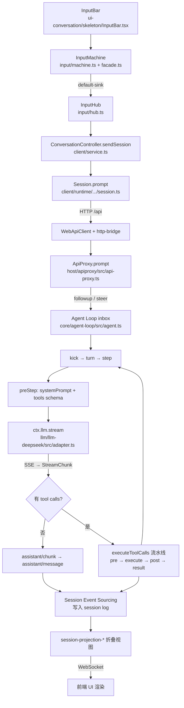

# DeepSeek Harness 源码分析

> 仓库地址：https://github.com/deepseek-ai/deepseek-harness

## 0. 先破题：它到底是个什么东西

DeepSeek Harness 开源后，很多人第一反应是"一个带聊天界面的模型调用工具"。但从源码看，官方对它的定位要底层得多：

**它的核心不是某个聊天组件，而是由 `Cordis Context + Service + Event + Plugin Fiber` 组成的 Agent Harness。**

也就是说，它要解决的问题不是"怎么把模型接进聊天窗口"，而是：

> **如何搭建一个可组合、可扩展的 Agent 运行底座。**

判断标准很简单：在这套代码里，模型是插件，工具是插件，UI 是插件，权限是插件，持久化是插件，连 Agent Loop 本身也是插件。

本文沿着"用户在对话框里输入一句话"这条主线，从前端一路拆到模型请求与工具执行，最后再回到设计思想层。

---

## 1. 项目结构

仓库是一个 pnpm monorepo，`package.json` 中声明的 workspace 为：

```json
"workspaces": [
  "vendor/*",
  "packages/*/*",
  "native/landlock-run",
  "native/landlock-run/packages/*",
  "apps/*",
  "website"
]
```

注意 `packages/*/*` 这个两级 glob——**真正的功能包大多在 `packages/<能力域>/<具体包>` 下面，而不是平铺在 packages 第一层**。当前源码里约有 **226 个 package**。

### 1.1 顶层目录

| 目录 | 职责 |
| --- | --- |
| `apps/cli` | 命令行入口。`apps/cli/src/bin.ts` 解析 `dsh web`、`profile`、`plugin`、`dump-config` 等命令，并调用 boot 层加载 profile |
| `apps/web` | Web 前端壳。`apps/web/src/main.ts` 很薄，只负责把 `@deepseek-ai/dsh-client-web` 挂载到 `#root` |
| `packages` | Harness 主体功能区，按能力域拆分：`core`、`llm`、`client`、`host`、`fs`、`shell`、`sandbox`、`subagent` 等 |
| `vendor` | 内置改造过的 Cordis 相关包：`cordis`、`loader`、`include`、`group`、`hmr`、`timer`、`schemastery`。**插件化底座在这里** |
| `native` | Native 辅助能力，目前重点是 `landlock-run`，服务 Linux sandbox 场景 |
| `python` | Python SDK / runtime，方便外部用 Python 侧驱动或集成 Harness |
| `docs` | 架构、Cordis primer、cookbook、子系统文档、工具流水线、扩展指南。**源码分析时非常关键** |
| `examples` | 独立示例：ACP、headless、JSON-RPC、MCP memory、web schedule 等 |
| `website` | 文档站点 |
| `scripts` | 构建、发布、类型生成、快照等脚本 |
| `patches` | 依赖 patch |

一句话概括顶层分工：

> **apps 是入口，packages 是产品能力，vendor 是框架底座，docs / examples 是说明与示范。**

### 1.2 packages 能力域地图

| 能力域 | 代表子包 | 职责 |
| --- | --- | --- |
| **boot** | `app-boot`、`cmdline` | profile 初始化、分层配置读取、Cordis Loader 启动。`profile.ts` 定义 web / headless 等 profile 模板 |
| **bundle** | `base`、`web-app`、`headless` | 预置插件组合。`cordis.patch.yml` 声明插件行，决定启动时挂载哪些能力 |
| **core** | `agent`、`agent-loop`、`session`、`tools`、`system-prompt`、`scope` | Agent 核心：主循环、Agent 框架、工具调用与执行、系统提示词模板 |
| **llm** | `llm`、`llm-deepseek`、`llm-pi-ai`、`llm-retry`、`token-meter` | 模型抽象与适配层。`llm` 定义接口，`llm-deepseek` 适配 DeepSeek 官方 provider |
| **client** | `runtime`、`connection`、`web`、`ui-components`、`ui-layout`、`ui-settings`、`ui-tool`、`ui-model-selection` | 运行容器与前端 UI 组件：会话连接、设置页、工具卡片、模型选择 |
| **host** | `webserver`、`apiproxy`、`frontend-static`、`plugin-inventory`、`directory-picker` | Node Host 服务端：HTTP/WebSocket、RPC API、前端静态资源、插件清单、目录选择 |
| **api** | `gateway`、`remotes` | 前后端 RPC 及跨实例调用网关，提供 `session.prompt`、权限设置等 Host API |
| **session** | `session-persistence-*`、`session-projection-*`、`session-retrieval-*` | 会话持久化、投影更新、长度统计、检索、Session log 导出 |
| **settings / credentials / storage** | `settings-file`、`credentials-local`、`storage-sqlite` | 配置、凭证、存储；解析基础服务凭证，提供产品级隐私文件加密 |
| **fs** | `fs`、`fs-local`、`fs-sandbox`、`fs-ssh`、`tool-fs-search`、`tool-fs-replace-editor` | 文件系统能力分层 |
| **interaction** | `commands`、`user-approval`、`user-questions`、`tool-call-views` | 与用户的交互层：提问、权限询问、Slash command |
| **shell / sandbox** | `tool-bash`、`host-local`、`bash-sandbox`、`subprocess-killer`、`sandbox-policy` | Shell 执行与沙箱隔离 |
| **guard** | `network-policy`、`network-deny-*` | 网络安全策略 |
| **compaction** | `compaction`、`compaction-basic`、`command-compact`、`compaction-tool-result-pruner` | 上下文压缩与裁剪，节省 token |
| **context** | `agent-instructions`、`file-reference`、`session-reference`、`time-context`、`tmux-context` | 动态上下文注入：工作区说明、文件引用、时间上下文等 |
| **skill** | `skill`、`skill-filesystem`、`skill-badge`、`tool-skill` | Skill 注册表、本地 skill provider、skill 工具 |
| **subagent** | `subagent`、`subagent-spawn-in-process` | 子 Agent 能力与并发 provider，支持层级拆解协同 |
| **mcp** | `mcp-client` | MCP Server 接入，外部工具挂到 `ctx.tools` |
| **workflow** | `workflow`、`workflow-worker-thread`、`toolkit-io` | Workflow 引擎与流程工具链 |
| **goal / plan / jobs / schedule / todo** | `tool-goal`、`plan-mode`、`todo-*`、`schedule` | 目标分解、计划模式、后台任务、调度、TODO 工具 |
| **sdk / acp** | `sdk-client`、`sdk-server`、`sdk-protocol`、`acp` | 扩展体系：工具、UI 与运行时扩展机制 |
| **test-support** | `agent-loop-tests`、`llm-replay`、`client-runtime` | 测试工具链与 mock / replay 能力 |

理解方式：

> **boot / bundle 负责启动装配；core + llm + client + host + api + session 构成主干；其余分层提供基础设施、执行环境与扩展生态能力。**

### 1.3 一个值得注意的拆法

文件能力不是一个 `FileTool` 包搞定，而是拆成四层：

```
fs            服务定义（Service Definition）
fs-local      本地实现（Service Provider）
fs-sandbox    沙箱封装（Service Provider）
tool-fs       面向模型的工具（Consumer）
tool-fs-search / tool-fs-replace-editor  更多 Consumer
```

这就是后文要讲的 **"Service Definition / Service Provider / Consumer"** 思路。

---

## 2. 从 `dsh web` 到插件树

安装只需一条命令：

```bash
npx @deepseek-ai/dsh web
# dsh web: http://127.0.0.1:3080
# dsh web: opening the default browser; pass --no-open to disable
```

运行 `dsh web` 时，本质会走 boot 层：读取环境变量、profile 和 patch，然后创建 Cordis `Context`。关键代码路径：

```
apps/cli/src/bin.ts                        命令解析
packages/boot/app-boot/src/profile.ts      profile 模板
packages/boot/app-boot/src/index.ts        boot() 主流程
packages/bundle/base/cordis.patch.yml      基础插件组合
packages/bundle/web-app/cordis.patch.yml   Web 插件组合
```

`profile.ts` 里能看到默认 profile 模板：

```ts
export const PROFILE_TEMPLATES: Record<string, readonly string[]> = {
  web:      ['@deepseek-ai/dsh-base', '@deepseek-ai/dsh-web-app'],
  headless: ['@deepseek-ai/dsh-base', '@deepseek-ai/dsh-headless'],
}
```

所以 `dsh web` 不是硬编码启动一堆类，而是按序加载：

1. `dsh-base` —— 基础插件组合
2. `dsh-web-app` —— Web 应用插件组合
3. 用户 profile 下的 `cordis.patch.yml`
4. home patch 与命令行 patch

`boot()` 的核心动作只有两步：

```ts
const ctx = new Context()
// 安装 Cordis Loader，把 bundle 和 patch 声明的插件行挂进去
```

**插件是否真正执行，取决于它声明的 `inject` 服务是否已经 ready。** 这是理解整个启动流程的关键——不是"加载即运行"，而是"依赖就绪才运行"。

### 2.1 base bundle：一套可运行的 Agent spine

`packages/bundle/base/cordis.patch.yml` 声明了基础 Agent 能力集合：

| 分组 | 内容 |
| --- | --- |
| Cordis 基础 | `timer`、`hmr` |
| LLM Runtime | `@deepseek-ai/dsh-llm`，默认 provider `deepseek-official`，默认模型 `deepseek-v4-flash` |
| 会话与配置 | `session`、`settings`、`credentials`、`session persistence` |
| 核心主干 | `agent`、`agent-loop`、`system-prompt`、`tools`、API gateway |
| 执行与安全 | `subprocess`、`sandbox`、`approval` |
| 工具能力 | `bash`、`fs`、`skill` |
| 高级能力 | `web`、`subagent`、`workflow` |
| 模型适配器 | `@deepseek-ai/dsh-llm-deepseek` |

结论：**base bundle 本身已经是一套可运行的 Agent spine**，不依赖任何 UI。

### 2.2 web-app bundle：在 spine 上长出界面

`packages/bundle/web-app/cordis.patch.yml` 在 base 之上挂载 Web 相关插件：

| 分组 | 内容 |
| --- | --- |
| Web 环境 | Web persona、工作目录等面向 Web 场景的运行环境补充 |
| Host 侧 | `webserver`、`frontend-static`、`apiproxy`、`directory-picker`、`plugin-inventory` |
| Client Runtime | `runtime`、`connection`、`api-remotes` |
| UI 插件 | `conversation`、`layout`、`settings`、`tool card`、`model selection` |
| 高级 Agent UI | `skill`、`subagent`、`plan`、`goal`、`jobs`、`trajectory`、`agent presets` |

**这里有一个关键设计需要特别注意**：

Web bundle 里有大量 `disabled` 的 base 工具行配置。注释说明得很清楚——Web 会把 **model-facing tools 移到 agent preset 平面**，而不是全部挂在 Host 根上下文。

目的是：**让每个 Agent preset 拥有自己的工具可见性与作用域**，便于隔离、控制与按场景组织能力。

> 理解方式：`dsh web` 先加载 web profile，组合 `dsh-base` 与 `dsh-web-app`；随后由 Cordis Loader 装载两棵插件树，最终启动 Web Host 与前端 UI。

---

## 3. 主链路：发送一句话后，背后发生了什么

以输入 **"帮我分析一下这个项目"** 为例。它不是直接 `fetch('/chat')`，整条链路被拆成：

```
前端输入状态机 → 前端会话 API → Host RPC → Agent Loop
  → LLM Streaming → 工具执行 → Session Event 投影
```

下面逐段拆开。

### 3.1 InputBar：前端输入框

```ts
packages/client/ui-conversation/src/client/skeleton/InputBar.tsx
```

处理 textarea、按钮、键盘事件、IME 输入、菜单状态、运行中 stop 等 UI 细节。核心行为：

- 点击发送按钮 → `inputActions.submit()`
- 按 Enter，且不是 IME 组合态、不是菜单选择、不是锁定状态 → `keyboard.submit(...)`
- Agent 正在运行时，主按钮变成 stop

> **注意**：InputBar 只是 UI 壳，它不直接知道后端 API，而是把动作交给输入状态机和 facade。

### 3.2 InputMachine：输入状态机

```ts
packages/client/ui-conversation/src/client/input/machine.ts
packages/client/ui-conversation/src/client/input/facade.ts
```

`machine.ts` 开头的注释就说明了设计：这是一个**纯粹的 per-session 输入状态机**，只接收事件、产出 effect，不依赖 React、DOM、Cordis。

它解决的问题：

- 当前输入是不是 slash command？
- 输入是否为空？
- 是否有 inline reference？
- submit 成功后清空草稿，失败后恢复草稿
- trigger popup / slash command / normal text 的分流

普通文本最终会产出一个 `default-sink` effect。`facade.ts` 是 effect executor，接到 `default-sink` 后序列化 inline references，然后调用：

```ts
deps.defaultSink(draft.trim(), imageIds, mode, signal)
```

### 3.3 InputHub：把输入接到 conversation

```ts
packages/client/ui-conversation/src/client/input/hub.ts
```

`InputHub` 负责每个 session 的输入 shell，把 normal text 的 sink 接到：

```ts
conversation().sendSession(session, text, imageIds, mode, signal)
```

> 输入层只知道"这是一条 session prompt"，不关心 RPC 细节。

### 3.4 ConversationController：构造 Prompt 内容

```ts
packages/client/ui-conversation/src/client/service.ts
```

`ConversationController` 是前端的 conversation 服务，挂在 `ctx.conversation` 上。`sendSession()` 把文本和图片整理成 content blocks：

```ts
const content = [{ type: 'text', text }, ...images]
session.prompt(content, mode, signal)
```

普通文本就是：

```ts
[{ type: 'text', text: '帮我分析一下这个项目' }]
```

### 3.5 Session.prompt：前端 RPC

```ts
packages/client/runtime/src/client/sessions/session.ts
```

前端 `Session` 的 `prompt()` 调用：

```ts
this.api.sessions.prompt({
  sessionId, mode, content, clientTimeZone,
})
```

`this.api` 来自 `packages/api/gateway` 生成的 remote，实际请求由 connection 层发出：

```
packages/api/gateway/src/client/index.ts
packages/client/connection/src/client/web-api-client.ts
packages/client/connection/src/client/index.ts
```

`WebApiClient` 做两件事：

- 普通 RPC → HTTP `/api`
- session event / host event → WebSocket

### 3.6 Host 侧 `/api`：client connection + apiproxy

```
packages/client/connection/src/index.ts
packages/host/webserver/src/index.ts
packages/client/connection/src/http-bridge.ts
packages/host/apiproxy/src/api-proxy.ts
```

`client/connection` 的 Host 插件注册 `/api` route。HTTP 请求进来后，通过 `http-bridge` 转成 fetch-shaped handler，再交给 api proxy，最终命中 `ApiProxy.prompt(request)`。

`prompt()` 大致做这些事：

1. 校验 `clientTimeZone`
2. 找到 session 对应的 Agent
3. 检查当前模型 provider / model 是否可用
4. 处理图片 admission 和持久化内容
5. 创建 `UserMessage`
6. 根据 mode 分流：
   - `queue` / 普通消息 → `agent.followup(message)`
   - `steer` / 运行中插入下一步 → `agent.steer(message)`
7. 返回 `{ accepted: true }`

> **关键**：返回 `accepted` 不代表模型已经回答完，只代表"消息已经被 Agent 接收"。后续结果通过 session event 流回前端。

### 3.7 Agent Loop：turn / step 循环

```ts
packages/core/agent-loop/src/agent.ts
```

`ReactLoopAgent` 维护一个 **inbox**：

- `followup()` → 把用户消息放入 inbox，标记为 `next-turn`，然后 `wakeDriver()`
- `steer()` → 标记为 `next-step`

Agent driver 被唤醒后进入：

```
kick() → turn() → step()
```

**为什么一个 turn 会有多个 step？** 因为模型可能先调用工具，工具结果回来后还要继续请求模型，直到没有工具调用或被策略终止。

`turn()` 的典型事件顺序：

```
turn/start
  step/start
    user/message
    assistant/chunk*
    assistant/message
    tool/call*
    tool/result*
  step/end
turn/end
```

这些事件会写入 session log，前端也靠它们渲染聊天内容、工具卡片和运行状态。

### 3.8 Prompt 组装：systemPrompt + tools

```ts
packages/core/system-prompt/src/index.ts
packages/core/tools/src/index.ts
packages/core/agent-loop/src/agent.ts
```

每个 step 之前，Agent 会执行 `preStep()`：

1. 从 inbox claim 用户输入
2. 组装系统提示词
3. 渲染动态 runtime context
4. 触发 `agent/pre-step` 扩展点

`system-prompt` 负责有序 section、动态 context、工具 schema 和 prompt variables；`tools` 注册表负责把当前可见工具的 schema 加入模型请求。

> 工具插件只要 `ctx.tools.register()`，schema 就会自然进入 prompt assembly。

### 3.9 LLM 请求：`ctx.llm` → DeepSeekAdapter

```ts
packages/llm/llm/src/index.ts
packages/llm/llm-deepseek/src/index.ts
packages/llm/llm-deepseek/src/adapter.ts
```

`ctx.llm` 是模型服务。模型 provider 不写死在 Agent Loop 里，而是通过 adapter 注册：

```ts
ctx.llm.registerAdapter(['deepseek-official'], adapter)
```

Agent Loop 在 `step()` 里调用：

```ts
ctx.llm.prepareCall(...)
ctx.llm.stream(...)
```

如果当前 provider 是 `deepseek-official`，最终走 `DeepSeekAdapter.stream()`。它构造 OpenAI-compatible chat completions 请求，发送到：

```
${baseURL}/chat/completions
```

以 SSE 方式解析流式响应，chunk 被转换成 Harness 自己的 `StreamChunk`，再由 Agent Loop 写成 `assistant/chunk` 与 `assistant/message`。

### 3.10 工具调用流水线

```ts
packages/core/agent-loop/src/tool-calls.ts
packages/core/tools/src/index.ts
docs/tool-execution-pipeline.zh.md
```

模型返回 tool calls 后，Agent Loop 进入 `executeToolCalls()`。**工具调用不是简单地执行函数，而是一条流水线**：

```
tool/call
  → tools/pre-execute    可做 allow / deny / ask
  → tools/execute        真正执行点，可被 timeout、retry、metrics 包裹
  → tools/post-execute   转换结果，或注入额外上下文
  → tools/result         最终结果观察点
  → tool/result          持久化会话事件，写入 session log
```

这条流水线带来的好处：**权限、沙箱、超时、日志、UI 展示、结果裁剪都能作为插件加进来，而不是塞进每个工具实现里。**

### 3.11 完整流程图



---

## 4. 流程背后的设计思想

### 4.1 Session Event Sourcing

Harness 非常强调 session event：**用户消息、助手 chunk、工具调用、工具结果、turn/step 边界都会进入 session log。**

对应的包分工：

- `packages/core/session` —— session 基础
- `packages/session/session-persistence-*` —— 持久化
- `packages/session/session-projection-*` —— 把事件折叠成前端可用视图
- `packages/session/session-retrieval-*` —— 检索

带来的好处：

1. UI 可以从事件**重放**出当前聊天状态
2. 崩溃后可以恢复
3. 测试可以做 replay
4. 模型请求可以从 session 历史推导，而不依赖某个不可追踪的内存对象

> 这是"状态即日志"的思路：**当前状态永远是事件流的函数，而不是被就地修改的可变对象。**

### 4.2 Agent Loop 是一个 Reactor

`ReactLoopAgent` 的核心不是"一问一答"，而是一个**响应式循环**：

- 用户消息进入 inbox 后，Agent 根据当前 phase 决定开新 turn 还是插入下一 step
- 模型如果调用工具，工具结果会影响下一 step
- 策略插件还可以通过事件在中途介入

### 4.3 Waterfall Event 中间件

几个关键事件是 waterfall：

```
agent/pre-step
agent/request
llm/stream
tools/pre-execute
tools/execute
tools/post-execute
tools/result
```

Waterfall 的特点是：**监听器必须显式调用 `next()` 才会交给下一个处理器**——这和 Koa / Express 中间件非常像。

这让"在工具执行前后插入策略"变成标准动作：超时、重试、审批、沙箱、埋点，各自一个插件即可。

### 4.4 Capability Seam：定义、提供者、消费者分离

很多能力都遵循这个结构：

```
Service Definition   定义 ctx.xxx 的接口
Service Provider     提供具体实现
Consumer             把能力暴露给模型、UI 或其他插件
```

以文件系统为例：

| 角色 | 包 |
| --- | --- |
| Definition | `fs` → 定义 `ctx.fs` |
| Provider | `fs-local`（本地）、`fs-sandbox`（沙箱封装） |
| Consumer | `tool-fs`（模型工具）、`tool-fs-search`、`tool-fs-replace-editor` |

好处是：**替换实现不影响消费者，新增消费者不影响实现。** 沙箱化只是换一个 provider。

### 4.5 前端输入也用了状态机

`InputMachine` 是纯状态机，`SessionInputShell` 负责执行 effect。这个拆分让输入逻辑脱离 React 组件，测试和维护都更稳定。

> 值得注意的一致性：**后端用状态机管 Agent 状态，前端用状态机管输入状态**——两边是同一种思维。

---

## 5. 如何理解"一切皆插件"

### 5.1 Cordis 插件是什么

Cordis 插件可以是函数、类，或带 `apply` 的对象。典型形态：

```ts
export const name = 'my-plugin'
export const inject = ['tools', 'llm']

export function apply(ctx, config) {
  // 注册工具、监听事件、扩展服务
}
```

生命周期类似：

```
PENDING → LOADING → ACTIVE → UNLOADING → DISPOSED
```

`inject` 声明依赖，**依赖未就绪则插件不激活**——这就是前文"加载不等于运行"的机制来源。

### 5.2 服务是 ctx 上的命名能力

插件不直接互相 import，而是通过 `ctx` 上的命名服务通信：

```ts
ctx.llm         // 模型服务
ctx.tools       // 工具注册表
ctx.fs          // 文件系统
ctx.conversation // 前端会话服务
```

服务按需注册、按需解析，天然支持替换与 mock。

### 5.3 注册都是可回收的 effect

插件注册事件、工具、模型适配器、prompt section，本质都是 effect。**插件卸载时，这些注册会自动清理。**

这意味着热重载（hmr）、动态启停能力、按 preset 切换工具集，都是框架原生能力，而不是额外补丁。

### 5.4 为什么要这样设计

主要有五个原因：

1. **Agent 产品变化太快** —— 能力与组合方式必须能快速增删
2. **安全策略必须可插拔** —— 审批、沙箱、网络策略要能按环境装配
3. **运行形态多样** —— Web、headless、SDK、ACP 不能共用一坨入口代码
4. **模型工具与 UI 展示需要解耦** —— 同一个工具，不同前端可以有不同呈现
5. **便于局部替换和测试** —— 用 replay 替换 llm，用 mock 替换 fs，即可离线测 Agent Loop

---

## 6. 源码清单速查

| 环节 | 路径 |
| --- | --- |
| CLI 入口 | `apps/cli/src/bin.ts` |
| Web 入口 | `apps/web/src/main.ts` |
| Profile 初始化 | `packages/boot/app-boot/src/profile.ts` |
| Boot 主流程 | `packages/boot/app-boot/src/index.ts` |
| Base 插件组合 | `packages/bundle/base/cordis.patch.yml` |
| Web 插件组合 | `packages/bundle/web-app/cordis.patch.yml` |
| Cordis 插件定义 | `vendor/cordis/src/registry.ts` |
| 对话输入框 | `packages/client/ui-conversation/src/client/skeleton/InputBar.tsx` |
| 输入状态机 | `packages/client/ui-conversation/src/client/input/machine.ts` |
| 前端会话服务 | `packages/client/ui-conversation/src/client/service.ts` |
| Session RPC | `packages/client/runtime/src/client/sessions/session.ts` |
| Host API 代理 | `packages/host/apiproxy/src/api-proxy.ts` |
| Agent Loop | `packages/core/agent-loop/src/agent.ts` |
| 工具调用流水线 | `packages/core/agent-loop/src/tool-calls.ts` |
| 系统提示词 | `packages/core/system-prompt/src/index.ts` |
| 工具注册表 | `packages/core/tools/src/index.ts` |
| LLM Runtime | `packages/llm/llm/src/index.ts` |
| DeepSeek Adapter | `packages/llm/llm-deepseek/src/adapter.ts` |
| 工具流水线文档 | `docs/tool-execution-pipeline.zh.md` |

---

## 7. 总结

DeepSeek Harness 最值得学习的不是"怎么调 DeepSeek 模型"，而是**它如何把一个复杂 Agent 产品拆成可组合能力**。

核心链路可以压缩成一条线：

```
UI 输入 → Session Prompt → Agent Loop → LLM Stream
  → Tool Pipeline → Session Event → UI Projection
```

而贯穿始终的是那句在源码里真实落地的话：

> **"一切皆为插件"不是一句口号。**
> 模型是插件，工具是插件，UI 是插件，权限是插件，持久化是插件，Agent Loop 也是插件。

三个最值得带走的工程点：

1. **Event Sourcing** —— 状态从事件流推导，天然支持重放、恢复与测试
2. **Waterfall 中间件** —— 策略以插件方式挂在流水线上，而不是写进每个工具
3. **Capability Seam** —— 定义 / 提供者 / 消费者三层分离，替换实现与新增消费互不干扰

## 8. 参考文章

> 本文基于以下资料整理与扩展，并结合源码进行二次分析。

| # | 标题 | 来源 | 链接 |
| --- | --- | --- | --- |
| 1 | DeepSeek Harness 源码解读 | 微信公众号 | [mp.weixin.qq.com](https://mp.weixin.qq.com/s/bWxT9dMtyrLsu2oV8Y5aug) |
